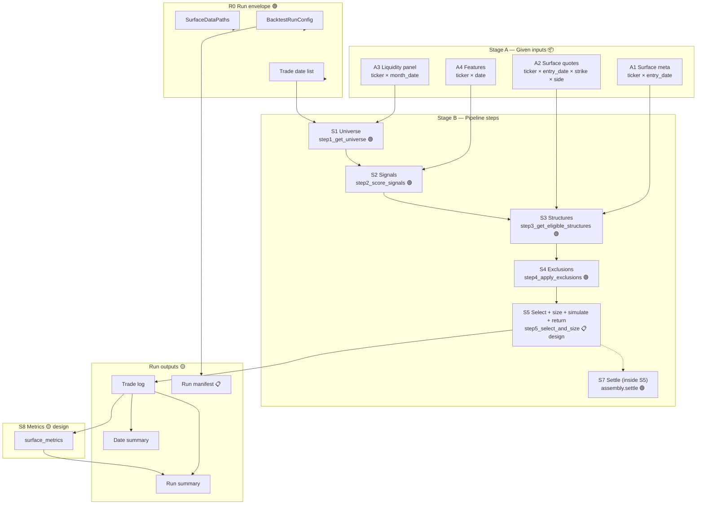

# Surface engine — data flow and component diagram

**Status:** Accepted — Sprint 002 (HD sign-off 2026-06-10); canonical for Stage B  
**Last updated:** 2026-06-10  
**Companion:** [surface_engine_data_contract.md](surface_engine_data_contract.md), [surface_engine_evaluation_plan.md](surface_engine_evaluation_plan.md)

---

## Purpose

Step-by-step **source of truth** for how data moves through the surface backtest. Each box is a component you can evaluate independently: what is built, what criteria it must meet, and which paths (success / skip / fail) it supports.

**Legend — implementation status**

| Tag | Meaning |
|-----|---------|
| 🟢 `built` | Implemented and covered by behavior or contract tests |
| 🟡 `partial` | Runs but missing contract fields or invariants |
| 📋 `spec-only` | Contract + test defined; code not implemented |
| 🔴 `drift` | Code path differs from target architecture |
| 📦 `given` | Stage A input; assumed this sprint |

---

## End-to-end diagram

---

## Box reference (fill criteria during Sprint 002)

Use this table with the diagram. Link each row to contract § and evaluation plan §.
✅ marks a box with a green L1 contract test.

| Box | Target owner | Status | Criteria to pass (structural) | Paths out |
|-----|--------------|--------|------------------------------|-----------|
| A1 Meta | precompute | 📦 given ✅ | Valid row for traded `(ticker, entry_date)`; `exit_spot`, `body_strike`, `surface_valid` | valid → S3; invalid → skip reason |
| A2 Quotes | precompute | 📦 given ✅ | Enough legs to build configured structure | ok → S3; missing → `no_tradeable_structure` |
| A3 Liquidity | build_liquidity_panel | 📦 given ✅ | PIT snapshot exists for `trade_date` | ok → S1; missing → empty universe |
| A4 Features | build_features | 📦 given ✅ | Row for `trade_date` per ticker | ok → S2; missing → drop |
| R0 Envelope | config + manifest | 🟢 ✅ | `start_date < end_date`; fractions in range; structure literals | → S1 loop |
| S1 Universe | `step1` | 🟢 ✅ | PIT snapshot; AND filters; rank-pct ∈ [0,1] | tickers → S2 |
| S2 Signals | `step2` | 🟢 ✅ | Disjoint long/short pools; CVG filter; no NaN scores | candidates → S3 |
| S3 Structures | `step3` | 🟢 ✅ | One row per signal; `structure_ok`; `_assembly` for settle | built → S4; fail → exclusion |
| S4 Exclusions | `step4` | 🟢 ✅ | `had_earnings_nearby` flag | → S5 |
| S5 Select + size + simulate + return | `step5` / runner | 📋 design | Select, size, S7 settle, `return_on_max_loss`; fill at S3 only — see [portfolio_metrics_design](surface_engine_portfolio_metrics_design.md) | → LOG |
| S7 Settle | `settle` (called from S5) | 🟢 ✅ | `pnl` consistent with `exit_spot` | internal to S5 |
| S8 Metrics | `surface_metrics` | 🟡 design | Target: Sharpe on max-loss series; today body-credit | → RSUM |
| ORCH | `SurfaceRunner` | 🟡 partial | S1–S4 pipeline; S5 inline | Sprint 003 thin loop |

---

## Decision paths (which backtest questions need which boxes)

| Decision you want to make | Minimum boxes that must be 🟢 + contract-clean |
|---------------------------|-----------------------------------------------|
| Is universe PIT-correct? | A3, S1 |
| Is signal ranking correct? | A4, S1, S2 |
| Is iron fly math correct? | A1, A2, S3, S7 |
| Is portfolio cap correct? | S2, S3, S5 |
| Is go/no-go Sharpe meaningful? | All S1–S8 + manifest |

---

## Architecture note

**Target:** `SurfaceRunner` orchestrates; **all** behavior in `pipeline.py` steps (decoupled). Remaining drift: runner inlines S5 select/size/settle/return. Outcomes for S5/S8: [surface_engine_portfolio_metrics_design.md](surface_engine_portfolio_metrics_design.md); implementation Sprint 003. S6 collapsed into S5.

---

## Relation to Sprint 001 doc

[surface_runner_data_flow.md](surface_runner_data_flow.md) captured the Sprint 001 audit map. This document becomes the **canonical** flow after HD review.

---

## Change log

| Date | Change |
|------|--------|
| 2026-05-28 | Sprint 002 scaffold + mermaid diagram |
| 2026-05-31 | Session A: IN/R0/S1/S2 boxes marked contract-pinned (✅); R0 → 🟢 |
| 2026-05-31 | Session B: S3/S4/S7 contract-pinned (✅) |
| 2026-05-31 | Session C: S5/S8/ORCH design-deferred; portfolio/metrics design doc |
| 2026-06-07 | S6 collapsed into S5; diagram S5 → LOG, S7 internal |
