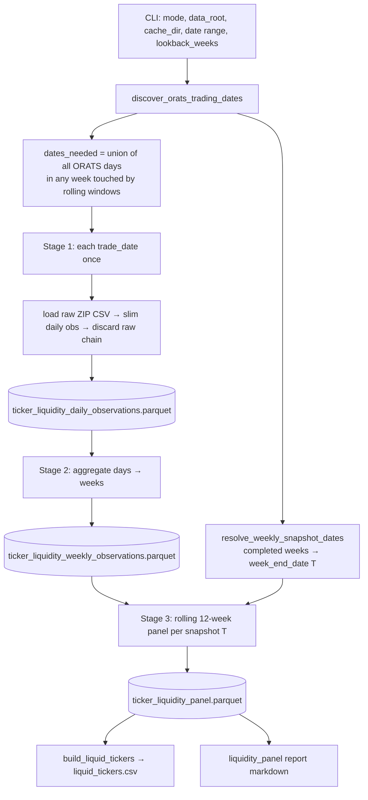

# C4 Design Plan — Weekly Point-in-Time Liquidity Component

**Commit:** C4 (implemented)  
**Status:** Draft v4 — reads **ORATS_Data raw ZIPs** directly (no ORATS_Adjusted dependency)  
**Post-C5 (2026-07-04):** Downstream surface/backtest reads **`input/adjusted_liquid`**, not legacy `ORATS_Adjusted` — see [sprint_memos/004_c5_adjusted_liquid.md](../sprint_memos/004_c5_adjusted_liquid.md).
**Prerequisite:** C1 + C2 accepted  
**Principle:** Replace the monthly adjusted-price panel with a **weekly point-in-time liquidity component** built from **raw** option observations via a three-stage pipeline (daily → weekly → rolling 12-week panel). Preserve Step1 consumer contract; do not touch strategy/S5/S8/ORCH.

**Input source:** `C:/ORATS/data/ORATS_Data/{YYYY}/ORATS_SMV_Strikes_{YYYYMMDD}.zip` — same raw tree as `apply_split_adjustment.py`. Liquidity does **not** require split-adjusted parquets; downstream surface/backtest still uses `ORATS_Adjusted` after **scoped** split adjustment on liquid names (C8 reorder is future work).

**Answers one question:**

> Can we rebuild `ticker_liquidity_panel.parquet` as a trustworthy weekly PIT liquidity component using raw option bid/ask/volume from ORATS_Data ZIPs, with each ORATS daily file read at most once?

**Does NOT answer:**

- Split-adjustment correctness (C5)
- Surface precompute audit (C6)
- PIT universe harness (C7)
- `validate` umbrella report (C3)
- `refresh` subprocess wiring (C8)
- Strategy profitability / backtest smoke

**Sprint references:** [current_sprint.md](../agenda/current_sprint.md) · [sprint004_execution_guardrails.md](../agenda/sprint004_execution_guardrails.md) · [v1_universe_protocol.md](../v1_universe_protocol.md) · [surface_engine_data_contract.md](../surface_engine_data_contract.md) § A3

---

## 1. C4 objective

Replace the current **monthly, adjusted-price, single-day-per-month** liquidity panel with a **weekly point-in-time liquidity component** suitable for the v1 weekly operator workflow. C4 is **not** a monthly panel and **not** a trading-day rolling panel; it is a **weekly snapshot panel** whose values are rolling aggregates over prior **weeks** of raw option liquidity.

**Operator model (weekly workflow):**

| Step | Timing | Data used |
|------|--------|-----------|
| Run build | **Saturday** (after prior week’s EOD is available) | Prior **completed week’s** ORATS daily files |
| Snapshot `T` | Last ORATS trading day of that completed week (typically Friday) | After-market, completed-week observation — **not** a pre-close same-day signal |
| Downstream use | Review week | Candidates for **next Friday** trade entry |

**Three-stage pipeline:**

```
daily raw observations  →  weekly liquidity observations  →  rolling 12-week panel
```

Each ORATS daily **raw ZIP** is read **at most once** per build. The final panel preserves Step1’s required columns (`month_date`, `ticker`, `atm_straddle_dollar_vol`, `atm_spread_pct`, `has_valid_atm_pair`). Raw prices measure **liquidity ranking only**; surface/backtest economics continue using adjusted columns from `ORATS_Adjusted` elsewhere.

**Intended weekly pipeline order (operator model):**

```
fetch_splits → build_liquidity_panel (ORATS_Data ZIPs) → liquid_tickers.csv
    → apply_split_adjustment --tickers … (scoped) → surface precompute (ORATS_Adjusted)
```

Liquidity runs **before** full split adjustment so universe shrink happens on cheap raw reads; only liquid names need adjusted parquets for surface/backtest.

---

## 2. Existing implementation summary

| Aspect | C4 `scripts/build_liquidity_panel.py` (implemented) |
|--------|-----------------------------------------------------|
| Input | **Raw ORATS ZIPs** under `ORATS_Data` (default `--data-root C:/ORATS/data/ORATS_Data`) |
| Snapshot grain | Completed ISO week — `week_end_date` = last ORATS day in week |
| Price basis | **Raw** `stkPx`, `strike`, `cBidPx`, … from ZIP CSV (no `adj_*`) |
| Expiry | All ATM expiries per ticker with DTE ∈ [5, 60]; sum bid-dollar vol |
| Dollar vol | `100 × min(cBidPx × cVolu, pBidPx × pVolu)` per expiry; **sum** across expiries |
| Spread | Bid-dollar-vol-weighted worse-leg spread; rolling mean in panel |
| Rolling | 12-week mean of weekly means (fixed `lookback_weeks` denominator) |
| Performance | One ZIP read per `trade_date` in `dates_needed`; slim daily obs cached |
| Downstream | `step1_get_universe` PIT lookup: `max(month_date ≤ trade_date)` |
| Tests | `tests/unit/test_build_liquidity_panel.py` (synthetic + ZIP I/O) |

**ORATS schema (raw ZIP CSV, confirmed via `src/data/split_adjuster.py` read path):**

- Required for liquidity: `stkPx`, `strike`, `cBidPx`, `cAskPx`, `pBidPx`, `pAskPx`, `cVolu`, `pVolu`, `expirDate`, `ticker`
- Split adjustment adds `adj_*` columns in `ORATS_Adjusted` parquets — **not used** by C4

**Inspected files:** `scripts/build_liquidity_panel.py`, `src/backtest/pipeline.py` (`step1_get_universe`), `src/data/split_adjuster.py`, `scripts/apply_split_adjustment.py`, `scripts/refresh_weekly_inputs.py`, `tests/unit/test_build_liquidity_panel.py`, `tests/contract/test_step1_universe_contract.py`.

---

## 3. Proposed C4 definition

### Stage 1 — Daily raw observation (per `trade_date`, `ticker`)

**Broad short-term liquidity — not single-target DTE:** C4 measures **universe-level** short-term ATM option liquidity. Do **not** pick one expiry closest to 7 DTE — that is too narrow and noisy. Do **not** use one global expiry for the whole day/file. Do **not** use `liquid_expiry_dates.csv`.

**Candidate expiries (per ticker, per day):**

- Include **all** expiries for that ticker with DTE ∈ **[5, 60]** on `trade_date`.
- This band represents the short-term option liquidity complex relevant to universe ranking.

**Daily row coverage (debugging vs metrics):**

| Situation | Daily row? | Metrics |
|-----------|------------|---------|
| Ticker **absent** from ORATS file on `trade_date` | **No row** | — |
| Ticker **present** but **no** expiry in DTE [5, 60] | **Yes — emit row** | `daily_atm_straddle_dollar_vol = 0`, `daily_atm_spread_pct = NaN`, `daily_has_valid_quote = False`, `no_expiry_in_band = True` |
| Ticker present with ≥1 candidate expiry | **Yes** | Computed per formulas below |

Rationale: a missing row is fine for rolling dollar-vol math (treated as 0), but operators need to distinguish “not in ORATS” from “in ORATS but no short-term expiry chain.” The daily parquet is the debug surface for that.

**Per candidate expiry — ATM row only (do not sum all strikes):**

- Using **raw** `stkPx` and raw `strike`: minimize `|strike − stkPx|`; tie-break lower strike.
- One ATM row per expiry.

**Liquidity intuition:**

- Contract volume alone is not comparable across tickers.
- **Raw option premium × volume** (× 100 contract multiplier) is a better dollar-liquidity proxy.
- **Bid price** (not mid) is more conservative and avoids overstating liquidity on extremely wide-spread options.
- **Summing** ATM straddle bid-dollar liquidity across DTE 5–60 better represents short-term tradability than a single ~7 DTE expiry.
- C4 ranks the universe; C6/surface/trade assembly can reject names where the exact target structure is not tradable.

**Per-expiry bid-dollar liquidity:**

| Metric | Formula |
|--------|---------|
| `call_bid_dollar_vol` | `100 × cBidPx × cVolu` |
| `put_bid_dollar_vol` | `100 × pBidPx × pVolu` |
| `expiry_atm_straddle_dollar_vol` | `min(call_bid_dollar_vol, put_bid_dollar_vol)` — conservative straddle across both legs |

**Daily dollar liquidity:**

```
daily_atm_straddle_dollar_vol =
    sum(expiry_atm_straddle_dollar_vol) over all candidate expiries
```

Treat NaN/missing leg volume as 0; invalid bid (non-finite or ≤ 0) → that expiry contributes 0 bid-dollar vol.

**Per-expiry spread (mid used for spread % only):**

| Metric | Formula |
|--------|---------|
| `call_mid_raw` | `(cBidPx + cAskPx) / 2` |
| `put_mid_raw` | `(pBidPx + pAskPx) / 2` |
| `call_spread_pct` | `(cAskPx − cBidPx) / call_mid_raw` |
| `put_spread_pct` | `(pAskPx − pBidPx) / put_mid_raw` |
| `expiry_atm_spread_pct` | `max(call_spread_pct, put_spread_pct)` — worse leg |

**Daily spread — bid-dollar-volume-weighted average across valid expiries:**

```
daily_atm_spread_pct =
    sum(expiry_atm_spread_pct × expiry_atm_straddle_dollar_vol)
    / sum(expiry_atm_straddle_dollar_vol)
    over candidate expiries with valid spread and expiry_atm_straddle_dollar_vol > 0
```

If total bid-dollar volume is **zero** → `daily_atm_spread_pct = NaN`.

**Daily quote validity** (`daily_has_valid_quote`): `daily_atm_straddle_dollar_vol > 0` **and** finite `daily_atm_spread_pct` (excludes `no_expiry_in_band` rows).

**Ticker absent from ORATS on `trade_date`:** no daily row. Downstream weeks treat absent days as zero dollar volume in weekly means. **`no_expiry_in_band` rows** are present in the daily parquet for debugging but contribute **0** dollar vol and do not count as valid-quote days.

### Stage 2 — Weekly liquidity observation (per completed week, `ticker`)

**Week boundary:** ISO week keyed by `week_end_date` = last available ORATS trading day in that calendar week (Mon–Sun), matching the Saturday-run / completed-week operator model.

For each `(week_end_date, ticker)` that appears in ORATS on at least one day in that week:

| Metric | Aggregation |
|--------|-------------|
| `weekly_atm_straddle_dollar_vol` | **Mean** of `daily_atm_straddle_dollar_vol` over all ORATS trading days in the completed week; denominator = count of ORATS days in that week; any missing ticker/day → **0** (not a sum of expiries or a sum of daily rows) |
| `weekly_atm_spread_pct` | **Mean** of `daily_atm_spread_pct` over days with `daily_has_valid_quote` only |
| `weekly_valid_quote_days` | Count of valid-quote days in the week |
| `weekly_has_valid_quote` | `weekly_valid_quote_days >= 1` (at least one tradable day in the week) |

Persist as `ticker_liquidity_weekly_observations.parquet` (grain: `week_end_date`, `ticker`).

### Stage 3 — Rolling weekly snapshot (per snapshot date `T`)

**Snapshot date `T`:** For each completed operational week, `T = week_end_date` (last ORATS day of that week). This is the PIT liquidity snapshot available when the operator runs on the following Saturday.

**Rolling window:** `window(T)` = last **`lookback_weeks`** (default **12**) weekly observations with `week_end_date ≤ T` — **weeks**, not trading days.

Per ticker in the union of tickers seen in the window:

| Output field | Definition |
|--------------|------------|
| `atm_straddle_dollar_vol` | Mean of `weekly_atm_straddle_dollar_vol` over full window; missing weeks → **0** (rolling mean of weekly mean-daily liquidity) |
| `atm_spread_pct` | Mean of `weekly_atm_spread_pct` over weeks with `weekly_has_valid_quote` only |
| `valid_quote_weeks` | Count of weeks with `weekly_has_valid_quote` |
| `has_valid_atm_pair` | `valid_quote_weeks >= min_valid_quote_weeks` (default **3**) |

**Why spread stays:** Dollar volume alone is insufficient — a name can show high premium×volume but wide bid/ask. Rolling average spread is retained as a tradability filter for Step1.

**PIT rule:** Snapshot `T` uses only weekly observations with `week_end_date ≤ T`. No future-week data.

**Canonical aggregation chain (dollar volume — do not mix sum/mean levels):**

```
daily_atm_straddle_dollar_vol  = sum of expiry ATM straddle bid-dollar vol over DTE [5, 60]

weekly_atm_straddle_dollar_vol = mean(daily_atm_straddle_dollar_vol)
                                 over ORATS trading days in the completed week
                                 missing ticker/day in that week → 0

atm_straddle_dollar_vol (panel) = mean(weekly_atm_straddle_dollar_vol)
                                  over last lookback_weeks (default 12)
                                  missing week in window → 0
```

**Spread chain:**

```
daily_atm_spread_pct   = bid-dollar-vol-weighted mean of per-expiry spreads (see above)
weekly_atm_spread_pct  = mean(daily_atm_spread_pct) over valid-quote days in the week only
atm_spread_pct (panel) = mean(weekly_atm_spread_pct) over valid-quote weeks in window only
```

There is **no** weekly sum of bid-dollar liquidity — only **mean of daily** values at the weekly stage, then **mean of weekly** at the panel stage.

---

## 4. Proposed data flow



### Backfill vs incremental

| Mode | Behavior | On missing/invalid artifacts |
|------|----------|------------------------------|
| **`backfill`** | Rebuild from scratch for declared date range: daily → weekly → panel (+ report); **always** persist all three parquets | N/A — creates artifacts |
| **`incremental`** | **Strict append-only** extension (see below) | **FAIL** — tell operator to run `--mode backfill` |

**C8** wires `--mode` on `refresh_weekly_inputs.py`; C4 implements mode semantics in `build_liquidity_panel.py`. C4 **`incremental` is not `repair`** — split repair / historical correction uses **`backfill`** with an explicit date window.

#### Incremental mode (strict, simple)

**Preconditions — all must pass or FAIL:**

| Check | Rule |
|-------|------|
| Artifacts exist | All three files present under `cache_dir`: `ticker_liquidity_daily_observations.parquet`, `ticker_liquidity_weekly_observations.parquet`, `ticker_liquidity_panel.parquet` |
| Schema match | Required columns and dtypes match the C4 contract (same set as backfill output). Any extra columns OK; **missing or renamed required column → FAIL** |
| Params match | `lookback_weeks`, `min_valid_quote_weeks`, `dte_min`, `dte_max` equal CLI args (incremental does not reinterpret history under new params) |

**Watermarks** (read from existing artifacts):

```
daily_watermark   = max(trade_date)
weekly_watermark  = max(week_end_date)
panel_watermark   = max(month_date)   # = snapshot_date
```

**Append rules — strictly newer only:**

| Artifact | Append rule |
|----------|-------------|
| **Daily** | Add rows only for `trade_date > daily_watermark`. Every new row must belong to the **new completed week** being appended. |
| **Weekly** | Add rows only for `week_end_date > weekly_watermark` (expected: **one** new completed week per routine incremental run). |
| **Panel** | Add rows only for snapshot `T > panel_watermark` where `T = week_end_date` of the new week. Compute **only** the new snapshot row(s) — rolling window reads weekly parquet (existing + newly appended week). |

**Explicit prohibitions:**

- **No repair** — do not re-open or rewrite rows on or before watermarks.
- **No partial historical rewrite** — do not recompute prior panel snapshots even if `lookback_weeks` window would now include different weeks; old snapshots are frozen at append time.
- **No gap fill** — if ORATS has `trade_date <= daily_watermark` not already in daily parquet → **FAIL** (*gap detected; run backfill*).
- **No silent backfill** — missing artifacts, schema drift, or overlap → **FAIL**, never fall back to full rebuild inside incremental.
- **No empty append masked as success** — if there is no completed week with `week_end_date > panel_watermark` → **FAIL** with *nothing to append* (operator likely needs to wait for EOD or check `--as-of`).

**Routine incremental flow (Saturday operator model):**

1. Validate preconditions + watermarks.
2. Resolve exactly **one** new `week_end_date` (= prior completed week’s last ORATS day) with `week_end_date > panel_watermark`.
3. Read ORATS **only** for ORATS days in that week with `trade_date > daily_watermark`.
4. Append daily → append weekly for that week → append **one** panel snapshot for `T = week_end_date`.
5. Write merged parquets (read existing + concat new; no in-place row edits).
6. Emit liquidity panel report noting mode=`incremental`, watermarks before/after, rows appended per artifact.

**When to use backfill instead:** first build, schema change, param change, ORATS gap, missed weeks, split repair, or any need to change history.

---

## 5. Proposed liquidity formulas

| Metric | Formula | Invalid / missing handling |
|--------|---------|---------------------------|
| Candidate expiries | All with DTE ∈ [5, 60] per ticker/day | No candidates → row with `no_expiry_in_band=True`, vol 0 |
| ATM strike | `argmin \|strike − stkPx\|` per expiry (ATM row only) | — |
| `call_bid_dollar_vol` | `100 × cBidPx × cVolu` | NaN vol → 0; invalid bid → 0 |
| `put_bid_dollar_vol` | `100 × pBidPx × pVolu` | Same |
| `expiry_atm_straddle_dollar_vol` | `min(call_bid_dollar_vol, put_bid_dollar_vol)` | Per expiry; 0 if either leg invalid |
| `daily_atm_straddle_dollar_vol` | **Sum** of `expiry_atm_straddle_dollar_vol` over candidates | Broad short-term complex |
| `expiry_atm_spread_pct` | `max(call_spread_pct, put_spread_pct)`; spread uses mid denominator | Invalid spread → exclude expiry from daily spread mean |
| `daily_atm_spread_pct` | Bid-dollar-vol-weighted mean of `expiry_atm_spread_pct` | Total bid-dollar vol = 0 → NaN |
| `weekly_atm_straddle_dollar_vol` | **Mean** of `daily_atm_straddle_dollar_vol` over ORATS days in week; missing day → 0 | Not a sum |
| `weekly_atm_spread_pct` | **Mean** of `daily_atm_spread_pct` over valid-quote days | — |
| Panel `atm_straddle_dollar_vol` | **Mean** of `weekly_atm_straddle_dollar_vol` over window; missing week → 0 | Rolling mean of weekly means |
| Panel `atm_spread_pct` | **Mean** of `weekly_atm_spread_pct` over valid-quote weeks | See §3 Stage 3 |

**Raw column resolution (deterministic):**

```python
# Required in ORATS raw ZIP CSV (native wide-format columns):
ticker, expirDate, stkPx, strike, cBidPx, cAskPx, pBidPx, pAskPx, cVolu, pVolu
# FAIL build if any required column missing after load
# Do NOT read ORATS_Adjusted; do NOT fall back to adj_* for liquidity metrics
```

---

## 6. Proposed rolling aggregation semantics

Stage 1–2 definitions are in §3 **Canonical aggregation chain**. This section pins the panel (Stage 3) roll-up.

For snapshot `T`, let `W = [w_{T−K+1}, …, w_T]` be the last `K = lookback_weeks` (default **12**) `week_end_date` values ≤ `T`:

```
atm_straddle_dollar_vol(T, ticker) =
    sum(weekly_atm_straddle_dollar_vol(w, ticker) for w in W) / K
    where weekly_atm_straddle_dollar_vol missing for week w → 0

atm_spread_pct(T, ticker) =
    mean(weekly_atm_spread_pct(w, ticker) for w in W if weekly_has_valid_quote)
    if valid_quote_weeks == 0 → NaN

has_valid_atm_pair(T, ticker) =
    valid_quote_weeks >= min_valid_quote_weeks
```

**Edge cases:**

| Case | Behavior |
|------|----------|
| `< K` weeks of history before `T` | Use all available weeks ≤ `T`; set `window_shortfall = K − len(W)`; **WARN** in report (HD-004-1: do not pretend full 12-week window) |
| Zero ORATS files in range | **FAIL** loudly with path hint |
| Ticker absent entire window | Omit row |
| Ticker present in some weeks only | Emit row; missing weeks count as 0 dollar vol |

**Defaults:**

| Param | Value | Justification |
|-------|-------|---------------|
| `lookback_weeks` | **12** | ~3-month rolling window in **weeks**, aligned with weekly strategy and sprint “3-month rolling” intent |
| `min_valid_quote_weeks` | **3** | ≥25% of 12-week window with at least one valid daily quote per week; excludes names with only brief liquidity spikes |

---

## 7. Proposed output schema

### Final panel — `ticker_liquidity_panel.parquet`

**Required (Step1 / A3 contract — unchanged names):**

| Column | Type | Notes |
|--------|------|-------|
| `month_date` | datetime/date | Weekly snapshot `T` (= `week_end_date`); **semantic change**, name kept for Step1 compat |
| `ticker` | str | |
| `atm_straddle_dollar_vol` | float | Rolling 12-week **mean of weekly mean-daily** bid-dollar liquidity |
| `atm_spread_pct` | float | Rolling mean spread (valid weeks only) |
| `has_valid_atm_pair` | bool | From `valid_quote_weeks >= min_valid_quote_weeks` |

**Recommended diagnostics (additive):**

| Column | Notes |
|--------|-------|
| `snapshot_date` | Duplicate of `month_date` — clearer alias |
| `lookback_weeks` | Param used (default 12) |
| `valid_quote_weeks` | |
| `zero_volume_weeks` | Weeks with zero weekly dollar vol |
| `window_start_date` | `week_end_date` of earliest week in window |
| `window_end_date` | = `T` |
| `window_shortfall` | `max(0, K − actual_weeks_in_window)` |
| `liquidity_source` | `"raw_option_bid_x_volume_sum_dte_5_60"` |

### Intermediate artifacts (always written)

C4 **always** writes both intermediate parquets — they are required for debugging and for **incremental** mode. No skip flag.

**Daily** — `{cache_dir}/ticker_liquidity_daily_observations.parquet`  
Grain: `(trade_date, ticker)` — slim columns only; no raw chain retention.

| Column | Notes |
|--------|-------|
| `trade_date`, `ticker` | Keys |
| `daily_atm_straddle_dollar_vol`, `daily_atm_spread_pct` | Core metrics |
| `daily_has_valid_quote` | bool |
| `n_candidate_expiries` | Count of expiries in DTE [5, 60] |
| `n_expiries_total` | All expiries for ticker that day (debug) |
| `no_expiry_in_band` | `True` when ticker in ORATS but `n_candidate_expiries == 0` |
| `liquidity_source` | constant |

**Weekly** — `{cache_dir}/ticker_liquidity_weekly_observations.parquet`  
Grain: `(week_end_date, ticker)`. `weekly_atm_straddle_dollar_vol` = mean of daily values (not a sum).

### Liquidity panel report (C4 → C3 input)

**Path (default):** `{cache_dir}/manifests/reports/liquidity_panel_{build_id}.md`

**Minimum sections:**

| Section | Content |
|---------|---------|
| Header | `build_id`, mode (`backfill` / `incremental`), resolved date range |
| Inputs | `data_root`, `cache_dir`, `lookback_weeks`, `min_valid_quote_weeks` |
| Execution | ORATS raw ZIP files read (count + min/max date), rows written/appended per artifact; incremental: watermarks before/after |
| Coverage | Snapshot count, ticker count, `% has_valid_atm_pair`, date range of panel |
| Debug | Daily rows with `no_expiry_in_band=True` (count + sample tickers/dates) |
| Warnings | Short windows (`window_shortfall > 0`) on **new** panel rows only; `no_expiry_in_band` counts |
| Status | **PASS** / **WARN** / **FAIL** + one-line summary |

C3 `validate` aggregates this report later; C4 owns generation only.

---

## 8. Performance / read-once design

1. **`discover_orats_trading_dates`** — glob `*/ORATS_SMV_Strikes_*.zip` under `data_root` (default `ORATS_Data`); path helper `orats_raw_zip_path(data_root, day)` in `build_liquidity_panel.py` (parallel layout to `split_adjuster` raw read, not `trading_day.orats_daily_parquet_path` which targets Adjusted parquets).
2. **`load_raw_day_from_zip`** — read CSV from ZIP via `zipfile`; `dtype={"ticker": str}`; return empty DataFrame if ZIP missing (dates come from discovery so this is rare); **no** split adjustment.
3. **`dates_needed`** — union of all ORATS days in every week touched by any output snapshot’s 12-week lookback. Extend discovery backward by `lookback_weeks` calendar weeks from range start.
4. **Stage 1:** `for trade_date in sorted(dates_needed):` load once → `compute_daily_liquidity_observations` → append slim rows → **drop raw `day_df`** before next date. Do **not** retain raw option-chain DataFrames across dates.
5. **Stage 2:** Aggregate from slim daily parquet/DataFrame in memory — no ORATS I/O.
6. **Stage 3:** Aggregate from weekly observations — no ORATS I/O.
7. **Injectable `load_day_fn`** for tests — assert `call_count == len(dates_needed)`.
8. **Do not** implement `for snapshot: for day in window: load(day)`.

**Incremental (performance):** Read existing three parquets once; read ORATS **raw ZIPs only** for `trade_date > daily_watermark` in the new week; append new slim daily rows; weekly/panel stages run on merged in-memory frames for the **new week / new snapshot only** — no full-history ORATS rescan, no rewrite of prior artifact rows.

---

## 9. Files expected to change (post-approval)

| File | Change |
|------|--------|
| `scripts/build_liquidity_panel.py` | Three-stage pipeline + `--mode backfill\|incremental` + report writer |
| `tests/unit/test_build_liquidity_panel.py` | **New** — synthetic tests (see §10) |
| `tests/contract/test_precompute_input_contract.py` | Optional; no required-column change |
| `docs/agenda/current_sprint.md` | Minimal C4 status line after implementation |

**Not in C4:** `pipeline.py`, `refresh_weekly_inputs.py` (C8), `v1_universe_protocol.md` (C9), new packages unless helpers exceed ~250 lines.

---

## 10. Tests to add / update

**New:** `tests/unit/test_build_liquidity_panel.py` (synthetic DataFrames, `tmp_path`, injectable loader)

| # | Test |
|---|------|
| 1 | Daily metric uses raw columns when both raw and adj present (adj wrong → raw wins) |
| 2 | ATM selection uses raw `stkPx` / `strike` (one ATM row per expiry, not all strikes) |
| 3 | Per-expiry bid-dollar vol = `100 × min(cBidPx × cVolu, pBidPx × pVolu)` |
| 4 | Daily dollar vol = **sum** of per-expiry straddle bid-dollar vol across DTE [5, 60] |
| 5 | Daily spread = bid-dollar-vol-weighted mean of per-expiry worse-leg spreads |
| 6 | Zero total bid-dollar vol → daily spread NaN |
| 7 | Ticker in ORATS with no DTE-band expiry → daily row, `no_expiry_in_band=True`, vol 0 |
| 8 | Weekly dollar vol = **mean** of daily values over ORATS days in week; missing day → 0 |
| 9 | Weekly aggregation groups by completed week (`week_end_date`) |
| 10 | Rolling panel uses only weeks ≤ snapshot `T` (no future leak) |
| 11 | Rolling window uses last **12 weeks**, not trading days |
| 12 | Panel dollar vol = mean of weekly means; missing week → 0 |
| 13 | Missing/invalid spread excluded from weekly/panel spread mean |
| 14 | `valid_quote_weeks` gates `has_valid_atm_pair` |
| 15 | Final panel preserves Step1-required columns + `snapshot_date` alias |
| 16 | Loader call count == unique `dates_needed` (no repeated reads) |
| 17 | `build_liquid_tickers` still works on rolling panel |
| 18 | Empty / insufficient source → FAIL with actionable message |
| 19 | **Incremental** without existing artifacts → FAIL (no silent backfill) |
| 20 | **Incremental** schema mismatch → FAIL |
| 21 | **Incremental** appends only rows with dates strictly after watermarks |
| 22 | **Incremental** does not modify pre-watermark rows in any artifact |
| 23 | **Incremental** gap (ORATS date ≤ watermark missing from daily) → FAIL |
| 24 | **Incremental** with no new completed week → FAIL |
| 25 | **Backfill** creates daily + weekly + panel artifacts |

---

## 11. Backward compatibility considerations

| Consumer | Impact | Mitigation |
|----------|--------|------------|
| `step1_get_universe` | None if required columns preserved | `month_date` holds weekly `T`; PIT `max(month_date ≤ trade_date)` works with denser snapshots |
| `liquid_tickers.csv` | Month → week grain | `build_liquid_tickers` groups by `month_date`; optional `snapshots_qualified` column |
| `liquid_expiry_dates.csv` | **Removed dependency** | All ATM expiries DTE [5, 60] per ticker/day; no global monthly expiry |
| Manifest `params.rolling_months` | Semantic mismatch | Defer rename to `lookback_weeks: 12` in **C9** (hash change — HD approval) |
| Panel row count | ~52× tickers/yr vs ~12× | Expected |

**No `step1_get_universe` modification** in C4.

---

## 12. Risks and edge cases

| Risk | Mitigation |
|------|------------|
| Raw vs adjusted ranks differ near splits | Intended; split-audit is C5 |
| Early history `< 12` weeks | `window_shortfall` + WARN in report |
| Holiday week with one ORATS day | Weekly obs still valid if `weekly_valid_quote_days >= 1` |
| ORATS gap mid-history | Missing days → 0 vol in weekly mean; WARN if whole week empty |
| Summing across many expiries inflates vs single-expiry metric | Intended — broad short-term complex; document in report |
| Wide-spread OTM strikes accidentally included | ATM row only per expiry; not all strikes |
| Ticker in ORATS but no short-term chain | Daily row with `no_expiry_in_band`; visible in report |
| Bid-dollar vol = 0 but quotes exist | Spread NaN; `daily_has_valid_quote` false |
| Incremental misuse | Explicit FAIL cases documented in §4; report lists watermarks |
| Param change after backfill | Incremental FAIL — requires backfill |
| Saturday vs Sunday operator run | Snapshot always tied to prior week’s `week_end_date`, not run calendar day |

---

## 13. Explicit out of scope (C4)

- Split correctness / split-audit (C5)
- Surface-audit (C6)
- PIT universe harness beyond liquidity-panel no-future-leak unit tests (C7)
- C3 `validate` umbrella aggregation (C3 consumes C4 report later)
- `refresh_weekly_inputs` subprocess wiring (C8)
- A4 / features / straddle_history (Sprint 005)
- Strategy / S5 / S8 / ORCH changes
- Backtest, Sharpe, parameter search
- Real ORATS cache in default pytest

---

## 14. Unresolved questions for HD

| # | Question | Recommendation |
|---|----------|----------------|
| **Q1** | **Use all ATM expiries with DTE 5–60 and sum bid-dollar straddle liquidity?** | **Yes** — broad short-term liquidity complex; less noisy than single ~7 DTE |
| **Q2** | **Bid-price vs mid-price for dollar liquidity?** | **Yes, bid** — conservative ranking; avoids overstating wide-spread names |
| **Q3** | **`min_valid_quote_weeks = 3` on 12-week window?** | As proposed |
| **Q4** | **Weekly dollar vol: mean of daily vs sum-of-week?** | **Resolved — mean of daily** over ORATS days in completed week; missing day → 0 (see §3 canonical chain) |
| **Q5** | **Always write daily + weekly intermediate parquets?** | **Yes** — required for debugging and incremental; no `--skip-intermediate-cache` |
| **Q6** | **`snapshot_date` alias column?** | **Yes** |
| **Q7** | **Receipt param `rolling_months` → `lookback_weeks`?** | Defer to C9 |
| **Q8** | **Incremental: rewrite prior panel snapshots when window params change?** | **Resolved — no.** Append one new snapshot only; param change → backfill |
| **Q9** | **Report path under `manifests/reports/` OK for C3?** | **Yes** — matches sprint default report layout |

---

## Proposed pure functions (inside `build_liquidity_panel.py`)

```python
orats_raw_zip_path(data_root, day) -> Path
load_raw_day_from_zip(data_root, trade_date) -> pd.DataFrame
make_raw_zip_loader(data_root) -> Callable[[date], pd.DataFrame]
discover_orats_trading_dates(data_root, start_date, end_date) -> list[date]
resolve_weekly_snapshot_dates(trading_dates, start_date, end_date) -> list[date]
candidate_expiries(expiries, trade_date, *, dte_min=5, dte_max=60) -> list[date]
compute_expiry_atm_liquidity(ticker_rows, expiry, trade_date) -> dict  # bid-dollar vol + spread
compute_daily_liquidity_observations(day_df, trade_date, *, dte_min=5, dte_max=60) -> pd.DataFrame
aggregate_weekly_liquidity_observations(daily_obs, trading_dates) -> pd.DataFrame
aggregate_rolling_weekly_panel(weekly_obs, snapshot_dates, lookback_weeks, min_valid_quote_weeks) -> pd.DataFrame
validate_incremental_artifacts(cache_dir) -> IncrementalState  # exists + schema + watermarks; raises on FAIL
build_panel(..., mode: Literal["backfill", "incremental"]) -> pd.DataFrame
write_liquidity_panel_report(...) -> Path
build_liquid_tickers(panel, dvol_top_pct, spread_bot_pct) -> pd.DataFrame
```

---

## Proposed CLI interface (post-approval)

```
--data-root                        default C:/ORATS/data/ORATS_Data (raw ZIP root)
--cache-dir                        default C:/MomentumCVG_env/cache
--mode backfill|incremental        (default: backfill)
--start-year / --end-year          (backward compat)
--start-date / --end-date          (ISO; overrides years)
--lookback-weeks                   (default 12)
--min-valid-quote-weeks            (default 3)
--dte-min / --dte-max              (default 5 / 60 — candidate expiry band)
--dvol-top-pct / --spread-bot-pct  (liquid_tickers.csv)
--build-id                         (optional; for report filename — else generated)
```

| 26 | `orats_raw_zip_path` + `discover_orats_trading_dates` find `*.zip` under year folders |
| 27 | `load_raw_day_from_zip` reads CSV from synthetic ZIP in `tmp_path` |

---

## HD decision summary (for sign-off)

1. **Weekly PIT component** — completed-week snapshot `T`, Saturday operator model.
2. **Three-stage pipeline** — daily raw → weekly → rolling 12-week panel.
3. **Raw bid × volume** at daily stage: sum across ATM expiries DTE [5, 60]; per-expiry straddle `min(call_bid$, put_bid$)`; weekly = **mean of daily**; panel = **mean of weekly**.
4. **Spread retained** — bid-dollar-vol-weighted daily spread; rolling average in panel.
5. **No single-target DTE** — broad short-term complex, not ~7 DTE pick.
6. **Backfill vs incremental** — incremental is strict append-only; FAIL on missing artifacts, schema drift, gaps, or overlap; **no repair / no historical rewrite**.
7. **Read-once** slim daily obs; no raw chains retained across dates.
8. **Liquidity panel report** for C3 aggregation.
9. **Always write** daily + weekly intermediate parquets (debug + incremental).
10. **Preserve Step1 columns**; add `snapshot_date` alias.
11. **Receipt params unchanged in C4.**
12. **Input = ORATS_Data raw ZIPs** — no `--source` flag; liquidity before scoped split adjust.

---

**Implemented** in `scripts/build_liquidity_panel.py` (2026-06-24, v4 raw-ZIP read path).
