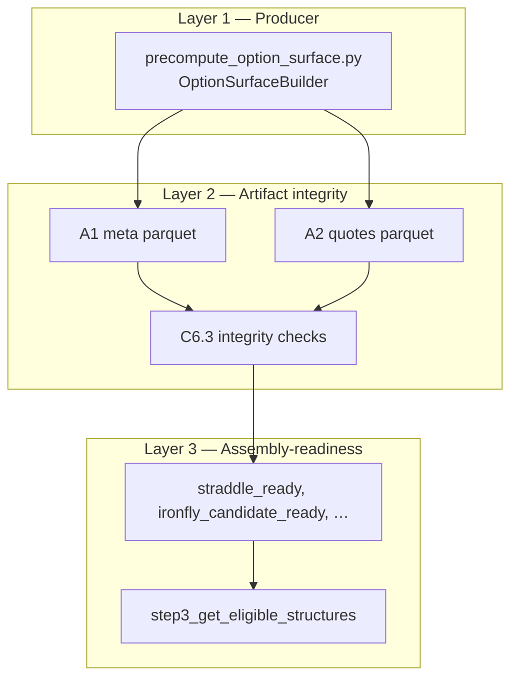

# C6.1 — Option Surface Design Memo

**Sprint:** 004 · **Task:** C6.1 (design only)  
**Date:** 2026-07-05  
**Mode:** Design / documentation — no code, tests, cache, or data changes  
**Inputs:** [c6_0_option_surface_reality_map.md](c6_0_option_surface_reality_map.md) (accepted), [current_sprint.md](../agenda/current_sprint.md), [surface_engine_data_contract.md](../surface_engine_data_contract.md)

**Status:** C6.1 design accepted — implementation-ready cleanup (2026-07-07)

---

## Scope and non-goals

### In scope

- Turn C6.0 findings into a locked design for the remainder of C6 (C6.1A → C6.6).
- Define three audit layers, `surface_valid` semantics, PASS/WARN/FAIL policy, and subtask deliverables.
- Specify what pytest proves vs what the artifact audit gate proves.

### Explicit non-goals

- No code, test, precompute, backtest, cache, or parquet changes in C6.1.
- No strategy profitability, Sharpe, or go/no-go conclusions.
- No full historical surface rebuild (stretch; sample + audit sufficient for closeout).
- No full spot DB refresh (document lineage; execute before C7/C8 and before C5-aligned smoke).
- No `refresh_weekly_inputs surface-audit` wiring (defer to C8 / C6.5).
- No A4 / feature pipeline work (Sprint 005).

### Sprint 004 closeout question C6 answers

> Can we trust A1/A2 option surface artifacts well enough that downstream `SurfaceRunner` / S3 assembly is not operating on silently broken inputs?

C6 proves **input-layer correctness and auditability**, not backtest evidence (Sprint 006+).

---

## Design summary

C6 is an **audit gate**, not a schema-only test sprint.

| Mechanism | Protects | When it runs |
|-----------|----------|--------------|
| **Layer 1 — Producer tests (C6.2)** | Code semantics in `option_surface_analyzer.py` + script args | pytest on synthetic fixtures |
| **Layer 2 — Artifact audit (C6.3/C6.4)** | On-disk meta + quotes parquets | read-only CLI on real cache |
| **Layer 3 — Assembly-readiness (C6.3)** | Whether valid surfaces can build straddle / iron fly / iron condor at S3 | computed audit metrics, not new A1 columns |

**Ordering:** C6.1 (this memo) → **C6.1A** (producer safety + paths + **entry** schedule only) → **C6.1B** (weekly expiry diagnostic) → **C6.1C** (weekly expiry semantics, if C6.1B supports) → C6.2 → C6.3 → C6.4 → C6.6.  
Optional **C6.1D:** soft-failure tags (recommended for clean T6 on regen); producer dedupe **only after** C6.4 duplicate triage.  
**Regenerated surface samples:** blocked until C6.1A lands. C6.4 pass 2 regen after C6.1A; **expiry semantics change waits for C6.1B/C6.1C** before expecting calendar-paired expiries in smoke output.

**Core semantic decision (validated against code):** Keep `surface_valid` as general A1/A2 surface validity. Do **not** fold iron fly / iron condor wing requirements into `surface_valid`. Wing and body-pair constraints are **assembly-readiness metrics** computed at audit time (Layer 3) and enforced at S3 assembly time.

---

## Three-layer design

```text
Layer 1 — Producer semantics
  OptionSurfaceBuilder + precompute_option_surface.py
  What rows *mean* when emitted; failure vocabulary; trade-date generation

Layer 2 — Artifact integrity
  On-disk A1/A2 parquets: schema, grain, join, settlement fields, date alignment

Layer 3 — Assembly-readiness
  Derived metrics on valid rows: can S3 build straddle / iron fly / iron condor?
```

Layers are **sequential dependencies**: Layer 2 assumes producer semantics are documented and (where applicable) tested; Layer 3 assumes Layer 2 passes integrity checks on the audited sample.



---

## Layer 1 — Producer semantics

### Owner files

| File | Role |
|------|------|
| `scripts/precompute_option_surface.py` | CLI, trade-date generation, parallel batching, parquet write |
| `src/features/option_surface_analyzer.py` | `OptionSurfaceBuilder`, `_metadata_*_row`, `_quote_rows` |

### What the producer guarantees (target contract)

For every `(ticker, entry_date)` in the run scope, the producer emits **exactly one** A1 meta row (success or failure) and **zero or more** A2 quote rows.

**Success path (`process_single_entry`):**

1. Resolve entry spot from chain provider; failure → `no_spot_price`.
2. Select expiry for configured `dte_target`; failure → `no_expiry_found`.
3. Load chain; failure → `no_options_at_entry`.
4. Pick body strike = nearest to entry spot (tie → lower strike).
5. Resolve exit spot at expiry; failure → `no_spot_at_expiry`.
6. Emit quote rows: body at `body_strike` + OTM wings in `[min_abs_delta, max_abs_delta]`; exclude ITM.
7. Emit meta via `_metadata_success_row`; set `surface_valid` per invariant below.

**Body leg flags vs quote inclusion:** `has_body_call` / `has_body_put` require positive bid, ask, and mid on raw chain quotes. `_quote_rows` may include body rows under `keep_zero_bid_quotes` or when chain has quotes that fail the stricter body flag check. This asymmetry is intentional for coverage audits but means **`surface_valid` can be False while quote rows exist** — audit should treat this as a soft failure (see failure vocabulary).

**Failure path (`_metadata_failure_row`):** All required A1 columns present; numerics null/zero; `surface_valid=False`; `failure_reason` set to a documented tag.

**Parallelism:** One joblib job per trade date; all tickers per date. Good ORATS cache locality; requires C6.1A ticker/date scoping for small samples.

### Trade-date generation (T4 precursor)

**HD decision (2026-07-07):** v1 / C6 targets **weekly only** — every calendar Friday in the requested range, resolved to the **last trading day of that week** when Friday is a holiday. Monthly subsampling (`sample_fridays_by_frequency`) is **not required for the first pass** and is deferred.

**HD decision (2026-07-07):** Consolidate **entry-date** calendar logic in **`src/data/trading_day.py`** in C6.1A (`weekly_trade_dates_in_range`). **Weekly expiry semantics are a separate decision** — see § Weekly expiry semantics (C6.1B / C6.1C); **not** part of C6.1A.

#### Weekly trade ↔ expiry model — target v1 semantics (HD clarified 2026-07-07)

This strategy is **weekly options**: hold from one week's resolution day to the next.

```text
entry_date        = last available trading day of week i
target_expiry_date = last available trading day of week i+1
```

Consecutive schedule entries define one weekly holding cycle explicitly.

| Mode | How `schedule` is built | Target expiry (design intent) |
|------|-------------------------|-------------------------------|
| **Historical / backtest / precompute** | `weekly_trade_dates_in_range` — file-existence walk-back per week | **`schedule[i+1]`** when `entry_date == schedule[i]` |
| **Forward / live / paper** | Current trade date known; next week's file may not exist | Calendar next week's resolution day (**no file check**) |

**Current production code (unchanged until C6.1C):** `OptionSurfaceBuilder._find_best_expiry` **chain-scans** listed ORATS expiries near target DTE (prefers Friday, then Thursday). This is **functionally robust** but **semantically loose** — it does not encode the weekly-cycle definition above.

**C6.1A does not change expiry picking.** C6.1B diagnoses whether calendar-paired expiry is viable; C6.1C implements it only if the diagnostic supports it.

**Existing cache note:** `option_surface_meta_weekly_2018_2026` uses chain-scanned expiry. C6.4 pass 1 may compare `expiry_date` vs next schedule date as **diagnostic evidence** (C6.1B), not as a FAIL until C6.1C lands.

#### Shared module design (`trading_day.py`) — C6.1A scope (entry schedule)

| Function | Role | C6 phase |
|----------|------|----------|
| `orats_daily_parquet_path` | Canonical chain file path | *(exists)* |
| `resolve_as_of_trading_day` | Point lookup: latest day ≤ `as_of` with a chain file (HD-004-2) | *(exists)* |
| `resolve_weekly_entry_date` | Friday anchor → last chain-file day that week (Fri→Mon, `max_lookback_days=5`) | **C6.1A** |
| `weekly_trade_dates_in_range` | Sorted weekly **entry** schedule for `[start, end]` (file-based) | **C6.1A** |
| `target_weekly_expiry_from_schedule` | `entry_date` → `schedule[i+1]` (pure helper for diagnostic + future producer) | **C6.1B** (diagnostic); **C6.1C** (wire producer) |
| `resolve_next_weekly_expiry_forward` | Forward/live: next week's resolution day by calendar (no file) | **C6.1C** (if calendar expiry approved) |

Functions below the line are **designed** in C6.1 but **implemented only after C6.1B evidence**, except the pure `target_weekly_expiry_from_schedule` helper used by the diagnostic.

**`resolve_weekly_entry_date`** is a thin wrapper over `resolve_as_of_trading_day(friday, root, max_lookback_days=5)` — same rule as today's `get_trading_fridays` inner loop, but reuses `orats_daily_parquet_path` and one implementation.

**`weekly_trade_dates_in_range(start, end, orats_adj_root)`** replaces script-local `get_trading_fridays` + `generate_trade_dates` for weekly C6 runs.

**Range:** `[start, end]` inclusive. Year args → `Jan 1` `start_year` … **`Dec 31` `end_year`** (not Feb 20).

**Per-week algorithm (one output date per calendar week):**

1. Take the calendar **Friday** of that week as the anchor (Fridays enumerate the weeks in `[start, end]`).
2. Walk back **Fri → Thu → Wed → Tue → Mon**; use the **first** day (starting from Friday) whose chain parquet exists under `data_root`.
3. That day is the week's **entry date** — the last trading day of the week *for which we have data*. On a normal week this is Friday; on a holiday week it may be Thursday or earlier.
4. **Only if no chain file exists on any weekday Mon–Fri** is the week omitted from the output list. That is a **data-gap edge case** (missing backfill), not normal operation. It matches today's producer warning: *"no trading day found in week, skipping"*.

So the schedule is **every week's last available trading day**, not "every Friday regardless of holidays." Weeks are not skipped when Friday is a holiday but Thursday has a file — Thursday becomes the entry date.

#### C6.1A migration scope (entry schedule + safety only)

| Remove / stop duplicating | Replace with | Phase |
|---------------------------|--------------|-------|
| `get_trading_fridays` in `precompute_option_surface.py` | `weekly_trade_dates_in_range` | **C6.1A** |
| Inline `ORATS_SMV_Strikes_*` path strings in producer | `orats_daily_parquet_path` | **C6.1A** |
| Hardcoded cache / data paths | `paths.py` constants + CLI flags | **C6.1A** |
| `OptionSurfaceBuilder._find_best_expiry` for weekly | **No change in C6.1A** — stays chain-scanned until C6.1C | C6.1C |

**Out of C6.1A:** expiry semantics (`_find_best_expiry` replacement), `resolve_next_weekly_expiry_forward` wiring, analyzer changes for calendar expiry.

**Out of C6.1A (follow-on):** identical `get_trading_fridays` copies in `precompute_straddle_history.py` / `precompute_ironfly_history.py` — migrate when those scripts are touched (Sprint 005).

**Current code gap (C6.1A fix):** `end_dt = datetime(end_year, 2, 20)` is a historical data shortcut; replace with `Dec 31` of `end_year` (or explicit `--end-date`).

**Deferred:** `sample_fridays_by_frequency` / monthly first-Friday **entry** sampling — not used in C6 evidence.

### Producer configuration defaults (operational risk)

**HD decision (2026-07-07):** **Input root** (`--data-root`) and **output root** (`--output-root`) must not be hardcoded in the producer script. Defaults live in **`src/data/paths.py`**; every path is overridable via CLI. Same pattern as C5.11A for `DEFAULT_ADJUSTED_LIQUID_ROOT`.

#### Path constants (`paths.py` — C6.1A extend)

| Constant | Proposed default | Used for |
|----------|------------------|----------|
| `DEFAULT_ADJUSTED_LIQUID_ROOT` | `C:/MomentumCVG_env/input/adjusted_liquid` | *(exists)* chain input `--data-root` |
| `DEFAULT_CACHE_ROOT` | `C:/MomentumCVG_env/cache` | **New.** Stage A output cache; `--output-root` default |
| `DEFAULT_SPOT_PRICES_PATH` | `DEFAULT_CACHE_ROOT / spot_prices_adjusted.parquet` | **New.** `--spot-db-path` default |
| `DEFAULT_LIQUID_TICKERS_PATH` | `C:/MomentumCVG_env/input/liquidity/liquid_tickers.csv` | **New (optional).** `--tickers-file` default; align with C4/C5 |

**Rule:** `precompute_option_surface.py` imports defaults from `paths.py` only — no inline `C:/MomentumCVG_env/...` strings. CLI flags override defaults at runtime.

**Follow-on (not blocking C6.1A):** `SurfaceDataPaths`, `refresh_weekly_inputs.DEFAULT_CACHE_DIR`, and `corporate_actions.DEFAULT_CACHE_DIR` should converge on `paths.DEFAULT_CACHE_ROOT` in C9 or Sprint 005 — document drift until then.

| Setting | Producer default (after C6.1A) | v1 consumer default | Notes |
|---------|-------------------------------|---------------------|-------|
| `--frequency` | `monthly` (legacy code) | weekly filenames in `SurfaceDataPaths` | C6 runs pass `--frequency weekly` |
| End of year range | `Feb 20` of `end_year` (bug) | full calendar year | C6.1A fixes to `Dec 31` |
| `--data-root` | `DEFAULT_ADJUSTED_LIQUID_ROOT` from `paths.py` | — | CLI override supported |
| `--output-root` | `DEFAULT_CACHE_ROOT` from `paths.py` | `SurfaceDataPaths.cache_dir` | CLI override; smoke → `cache/c6_smoke/` |
| `--spot-db-path` | `DEFAULT_SPOT_PRICES_PATH` from `paths.py` | C1 manifest `spot_prices` | CLI override supported |
| Ticker universe | hardcoded `cache/liquid_tickers.csv` today | — | C6.1A → `DEFAULT_LIQUID_TICKERS_PATH` or `--tickers-file` |

C6.1A and runbook (C9): **`--frequency weekly` required** for v1 surface filenames; do not use monthly sampling for Sprint 004 evidence.

### Layer 1 checks → C6.2 producer tests

| Check | Test home | Notes |
|-------|-----------|-------|
| T1 `surface_valid` invariant | contract + unit | success helper + full builder synthetic paths |
| T5 settlement fields on valid rows | unit on builder output | `exit_spot`, `expiry_date`, `body_strike`, `entry_spot`, `dte_actual` |
| T6 failure vocabulary | contract + unit | hard failures + soft failures (post-C6.1D) |
| T4 trade dates | `tests/unit/test_trading_day.py` | `weekly_trade_dates_in_range` + holiday fallback fixtures |
| Quote row schema / OTM filter | unit on `_quote_rows` | delta bounds, ITM exclusion, `is_body XOR is_otm` |
| Weekly expiry diagnostic | C6.1B report / script | chain-scanned vs target schedule expiry vs chain listing |

Layer 1 tests do **not** certify on-disk cache bytes — that is Layer 2.

---

## Layer 2 — Artifact integrity

### Artifacts

| Artifact | Grain (contract) | Real-cache note (C6.0) |
|----------|----------------|------------------------|
| A1 meta | `(ticker, entry_date)` | 0 duplicate meta keys |
| A2 quotes | `(ticker, entry_date, strike, side)` per contract; C6.0 scanned `(ticker, entry_date, expiry_date, strike, side)` | 9,682 rows in duplicate groups — triage required |

### Integrity rules (audit module)

| Rule ID | Check | Layer |
|---------|-------|-------|
| L2-01 | Required A1/A2 columns present (contract § A1/A2) | 2 |
| L2-02 | Meta grain unique on `(ticker, entry_date)` | 2 |
| L2-03 | Quote grain unique per **resolved grain key** (see duplicate policy) | 2 |
| L2-04 | No orphan quotes: every quote `(ticker, entry_date)` has meta row | 2 |
| L2-05 | No valid meta without quotes: `surface_valid=True` ⇒ ≥1 quote row | 2 |
| L2-06 | `surface_valid` matches `(has_body_call ∧ has_body_put ∧ n_surface_quotes > 0)` on all meta rows | 2 |
| L2-07 | Valid rows: `entry_spot`, `exit_spot`, `body_strike`, `expiry_date` non-null | 2 |
| L2-08 | Valid rows: `dte_actual == (expiry_date − entry_date).days` | 2 |
| L2-09 | Valid rows: quote `expiry_date` matches meta `expiry_date` | 2 |
| L2-10 | Valid rows: body quote strikes match meta `body_strike` | 2 |
| L2-11 | Invalid rows: `failure_reason` in closed vocabulary (policy varies pre/post C6.1D) | 2 |
| L2-12 | `side ∈ {call, put}`; `is_body` xor `is_otm` | 2 |
| L2-13 | OTM quotes within configured delta window (default [0.03, 0.45]) | 2 |
| L2-14 | Date alignment: meta `entry_date` set consistent with producer trade-date rules in sample range | 2 |
| L2-15 | Weekly DTE: flag `dte_actual` far from 7 when `frequency='weekly'` | 2 (WARN) |
| L2-16 | bid ≤ mid ≤ ask violations | 2 (WARN — ORATS mid may differ from naive mid) |

### Join semantics (consumer alignment)

`OptionSurfaceDB.get_metadata` raises on `surface_valid=False`. `step3_get_eligible_structures` catches that as `metadata_error:…`. Quotes are not filtered by meta validity at load time — orphan detection is an audit concern (L2-04), not a runtime DB feature.

---

## Layer 3 — Assembly-readiness

These metrics are **computed in the C6.3 audit** on meta+quotes parquets. They are **not** stored as A1 columns unless HD later approves a schema extension (not recommended for C6).

### Readiness definitions (aligned to S3 builders)

All readiness metrics are evaluated **conditional on `surface_valid=True`** unless noted.

| Metric | Definition | Maps to S3 |
|--------|------------|------------|
| `body_pair_ready` | Exactly 1 body call and 1 body put in quotes (`is_body`, by `side`) | `build_*` uses `.iloc[0]` per side — duplicates are ambiguous |
| `straddle_ready` | `surface_valid` ∧ `body_pair_ready` | `build_straddle_from_surface` |
| `otm_wing_pair_available` | ≥1 OTM call and ≥1 OTM put in quotes | Necessary but not sufficient for wings |
| `ironfly_candidate_ready` | `straddle_ready` ∧ `otm_wing_pair_available` | `build_ironfly_from_surface`; delta fit checked at assembly via `wing_target_delta` |
| `ironcondor_candidate_ready` | `straddle_ready` ∧ sufficient OTM quotes to pick short+long wings per condor geometry | `build_ironcondor_from_surface`; needs further-OTM long legs |

**Config-dependent readiness (INFO/WARN only in C6.3):** For a declared audit config (e.g. `wing_delta_target=0.15`, condor short/long deltas), optionally compute `%` of valid rows where assembly would succeed without spread filters. This mirrors S3 but does not require running the full pipeline. Defer exact config matrix to C6.3 implementation — default to structural checks above.

### Real-cache baseline (C6.0, existing cache)

| Metric | Rate (of `surface_valid` rows) | Audit treatment |
|--------|-------------------------------|-----------------|
| `body_pair_ready` | 57 failures (~0.02%) | WARN + sample keys |
| `otm_wing_pair_available` | 35,460 failures (~10.2%) | WARN — coverage, not integrity |
| `straddle_ready` | ~99.98% of valid | INFO |
| `ironfly_candidate_ready` | ~89.8% of valid | INFO |

**Principle:** Missing OTM wings on otherwise valid rows is a **coverage / strategy-yield** limitation, not a reason to mark the surface invalid. S3 already surfaces this as assembly exceptions (`failure_reason=str(exc)`).

### Layer 3 checks → audit only (not producer tests)

| Check | Home |
|-------|------|
| Readiness rates overall and by year | C6.3 report INFO section |
| Duplicate body rows affecting `body_pair_ready` | C6.3 WARN |
| Delta sign sanity (call δ≥0, put δ≤0) | C6.3 INFO/WARN |
| Optional config-scoped assembly probe | C6.3 stretch INFO |

---

## `surface_valid` semantics

### Definition (unchanged — matches code and contract)

```text
surface_valid == (has_body_call AND has_body_put AND n_surface_quotes > 0)
```

**Code anchors:**

- Producer: `_metadata_success_row` sets `surface_valid` exactly as above ([option_surface_analyzer.py](../../src/features/option_surface_analyzer.py) L123).
- Contract: [surface_engine_data_contract.md](../surface_engine_data_contract.md) § A1 invariant.
- Consumer: `OptionSurfaceDB.get_metadata` rejects rows where `surface_valid=False`.

### What `surface_valid` means

| Means | Does not mean |
|-------|---------------|
| Both ATM body legs had tradable quotes at build time | Iron fly / iron condor can be built |
| At least one quote row was emitted | Exactly one body call and one body put row |
| Row is eligible for S3 metadata load attempt | OTM wings exist for any delta target |
| Settlement fields populated on success path | Strategy is profitable or liquid enough for live trading |

### Relationship to readiness metrics

```text
surface_valid ──► required for any S3 attempt
straddle_ready ──► surface_valid + unique body pair (strict assembly precondition)
ironfly_candidate_ready ──► straddle_ready + OTM wing pair present (structural)
ironcondor_candidate_ready ──► straddle_ready + condor geometry feasible (structural)
```

S3 may still fail when `ironfly_candidate_ready=True` (spread filters, delta threshold, `max_spread_cost_ratio`). That is **assembly-time**, not A1 validity.

### Recommended audit reporting

Report `% surface_valid` separately from `% straddle_ready`, `% ironfly_candidate_ready`, etc. Low `surface_valid` (~33% on full universe in existing cache) is expected for broad ticker coverage and should **WARN**, not FAIL, unless HD sets a blocking threshold (none locked for 004 closeout).

---

## PASS / WARN / FAIL policy

Severity follows [current_sprint.md](../agenda/current_sprint.md) § Validation severity. Exit codes for C6.3 CLI: `0`=pass, `1`=blocking FAIL, `2`=usage/config error. `--strict` promotes selected WARNs to FAIL (C6.3 should support).

### FAIL (blocking — fails Blocks-005 B4 when on closeout sample)

| Check | Layer |
|-------|-------|
| Meta or quotes file missing / unreadable | 2 |
| Missing required schema columns | 2 |
| Duplicate meta `(ticker, entry_date)` | 2 |
| Orphan quotes (quote key without meta) | 2 |
| Valid meta with zero quote rows | 2 |
| `surface_valid=True` but settlement fields null | 2 |
| `dte_actual` mismatch on valid rows | 2 |
| Meta vs quote `expiry_date` mismatch on valid rows | 2 |
| Meta `body_strike` vs body quote strike mismatch on valid rows | 2 |
| `surface_valid` inconsistent with body flags / `n_surface_quotes` | 2 |
| Duplicate quote grain **after triage concludes true integrity violation** | 2 |
| Invalid rows with null `failure_reason` **on post-C6.1D regenerated artifacts** | 2 |
| Quote/meta join broken on audited sample (T2) | 2 |

### WARN (usable with documented limitation; does not block 004 closeout unless `--strict`)

| Check | Layer |
|-------|-------|
| Low overall `surface_valid` rate (report by year/ticker) | 2 / INFO |
| Invalid rows with null `failure_reason` **on legacy pre-C6.1D cache** | 2 |
| Unknown `failure_reason` tag (not in vocabulary) | 2 |
| Valid rows missing OTM wing pair (`otm_wing_pair_available=False`) | 3 |
| Valid rows failing `body_pair_ready` (duplicate or missing body rows) | 3 |
| bid > mid or mid > ask (810 rows in existing cache) | 2 |
| Weekly `dte_actual` outside ±4 of 7 | 2 |
| Stale artifact lineage (mtime pre-C5; spot DB pre-C5; undocumented `--data-root`) | 2 |
| Duplicate quote grain **pending triage** or **benign with documented dedupe** | 2 |
| Producer default frequency mismatch vs consumer weekly paths | ops |
| Ticker universe file diverges from C4/C5 liquid list | ops |

### INFO (report only)

| Check | Layer |
|-------|-------|
| Validity rate by year and ticker | 2 |
| `failure_reason` breakdown | 2 |
| Readiness rates: `straddle_ready`, `ironfly_candidate_ready`, `ironcondor_candidate_ready` | 3 |
| Artifact inventory: row counts, date range, file sizes, mtimes | 2 |
| Spot / adjusted-liquid lineage block (see below) | ops |

### Overall audit status aggregation

| Overall | Rule |
|---------|------|
| **FAIL** | Any blocking FAIL check |
| **WARN** | No FAIL; ≥1 WARN |
| **PASS** | No FAIL; no WARN (or WARN-only items explicitly suppressed) |

C6.4 archives the report and links it in sprint evidence. C3 `validate` will later aggregate this path (not C6 scope).

---

## Duplicate quote-grain policy

### Observation (C6.0)

Existing cache: **9,682** quote rows participate in duplicate groups on grain  
`(ticker, entry_date, expiry_date, strike, side)`.

Contract § A2 documents grain as `(ticker, entry_date, strike, side)` — **does not include `expiry_date`**. For valid rows, meta enforces a single expiry per `(ticker, entry_date)`, so the practical audit key matches contract grain. Duplicates remain a real integrity concern for assembly (`.iloc[0]` silently picks first).

### Do not assume producer bug

Duplicates may arise from:

1. **Under-specified A2 grain** — upstream chain carries multiple lines per strike (e.g. multi-root, adjustment flags) collapsed into one key.
2. **Upstream adjusted chain duplicates** — C5 daily parquets contain duplicate strikes; producer passes them through.
3. **Producer double-emit** — builder appends same quote twice (code defect).

### Triage procedure (C6.3/C6.4 — mandatory before FAIL)

```text
Step 1 — Sample
  Draw N duplicate groups (recommend N=50) stratified by ticker, year, side.
  Export full row payloads for each group member.

Step 2 — Compare within group
  Diff bid, ask, mid, volume, OI, greeks, nearest_delta_bucket.
  Classify:
    A — byte-identical duplicates
    B — same economics, different diagnostics only
    C — materially different quotes (ambiguous assembly)
    D — different expiry_date (grain spec issue)

Step 3 — Upstream check (sample)
  For subset, read matching adjusted_liquid chain row(s) for same key.
  Determine whether duplicate originates before or at producer.

Step 4 — Decision matrix
```

| Triage outcome | Action | Audit severity |
|----------------|--------|----------------|
| **A** — identical duplicates | Document; apply deterministic dedupe rule in audit | WARN on legacy; PASS if dedupe rule applied consistently in C6.3 metrics |
| **B** — diagnostic-only diff | Enrich grain or dedupe on `(strike, side, bid, ask, mid)` | WARN; consider contract doc update |
| **C** — ambiguous economics | Fail integrity unless dedupe rule picks max volume / latest / min spread | **FAIL** until resolved |
| **D** — expiry in grain | Add `expiry_date` to documented grain explicitly | WARN → update contract in C9 drift register |

### Proposed deterministic dedupe rule (default if triage shows A/B)

When duplicates share `(ticker, entry_date, strike, side)` on valid rows:

1. Prefer row with highest `volume + open_interest`.
2. Tie-break: lowest `spread_pct`.
3. Tie-break: lowest `strike` (deterministic, arbitrary).

Audit module applies this for readiness metrics and reports `n_deduped_quotes`. **Producer-side dedupe** is a separate, lower-priority change — only after C6.4 duplicate triage confirms the rule (see § C6.1D); not bundled with soft-failure tags.

### T3 test placement

| Stage | T3 enforcement |
|-------|----------------|
| **C6.3** pytest | Audit helper/module tests on synthetic parquets with injected duplicate grain |
| **C6.3** audit CLI | FAIL/WARN per triage outcome on real cache |
| **C6.1D** (conditional) | Producer-side dedupe before write — **only** if C6.4 triage warrants it |

C6.2 does **not** own duplicate-grain tests. If a shared helper module lands before C6.3 CLI wiring, its unit tests may land early, but **primary ownership is C6.3**.

**Until C6.4 triage completes:** T3 status = **needs audit / design decision**, not confirmed FAIL.

---

## Failure-reason vocabulary policy

### Closed vocabulary (hard failures — `_metadata_failure_row`)

| Tag | When |
|-----|------|
| `no_spot_price` | No entry spot |
| `no_expiry_found` | Expiry selection returned None |
| `no_options_at_entry` | Empty chain |
| `no_strikes_in_chain` | No strikes after chain load |
| `no_spot_at_expiry` | No exit spot at expiry |

### Soft failures (success path but `surface_valid=False`) — **C6.1D-a**

Today `_metadata_success_row` always sets `failure_reason=None` even when validity gate fails (~25.7k rows in existing cache). This violates T6 spirit.

**Proposed C6.1D-a tags** (exactly one when `surface_valid=False` on success path):

| Tag | Condition |
|-----|-----------|
| `missing_body_call` | `not has_body_call` (and put ok or not — prefer most specific) |
| `missing_body_put` | `not has_body_put` and call ok |
| `missing_body_legs` | both body flags false |
| `insufficient_surface_quotes` | body flags ok but `n_surface_quotes == 0` |
| `partial_body_and_quotes` | mixed partial state not covered above (fallback) |

Priority: use most specific tag; reserve `partial_body_and_quotes` for edge cases.

**Valid rows:** `failure_reason` remains `None` (or empty).

### Audit policy by artifact generation era

| Artifact era | null `failure_reason` on invalid rows |
|--------------|---------------------------------------|
| Legacy cache (pre-C6.1D, e.g. mtime 2026-04-23) | **WARN** with count + note |
| Post-C6.1D regenerated smoke | **FAIL** if any null on `surface_valid=False` |
| Unknown lineage | **WARN** until pass 2 smoke documents generation |

### Unknown tags

Any other non-null string → **WARN** `unknown_failure_reason:{tag}`; do not FAIL unless `--strict`.

---

## Date-alignment policy

### Three related concepts (do not conflate)

| Concept | Mechanism | Used by |
|---------|-----------|---------|
| **Weekly entry schedule** | `weekly_trade_dates_in_range` (file-based last day per week) | precompute, backtest — **C6.1A** |
| **Weekly expiry (target)** | `target_weekly_expiry_from_schedule` — next schedule date | **C6.1B** diagnostic; **C6.1C** producer if approved |
| **Weekly expiry (production today)** | `_find_best_expiry` — chain-scanned near DTE | producer until C6.1C |
| **CLI as-of resolution** | `resolve_as_of_trading_day` (same module) | `refresh_weekly_inputs.py` (HD-004-2) |
| **Runner trade dates** | From `BacktestRunConfig` / precomputed list | `SurfaceRunner` (Sprint 005 alignment) |

### Producer alignment spec (C6.1 locks)

For weekly v1 surfaces:

- **Entry schedule (C6.1A):** one last-trading-day per week via `weekly_trade_dates_in_range`; Fri→Mon walk-back; data-gap weeks omitted.
- **Expiry (until C6.1C):** producer continues **`_find_best_expiry`** chain scan — audit may **compare** to target schedule expiry (C6.1B) but does not FAIL solely on mismatch pre-C6.1C.
- **Expiry (after C6.1C, if approved):** `expiry_date == target_weekly_expiry_from_schedule(entry_date, schedule)`; no silent fallback to a different listed expiry.
- `[start, end]` full window (year args → Jan 1 … Dec 31).
- Every meta `entry_date` must appear in `weekly_trade_dates_in_range(...)` for the build window.
- `dte_actual` should match `(expiry_date − entry_date).days`.

### Audit checks (C6.3)

| Check | Severity |
|-------|----------|
| Recompute expected trade dates for sample window; compare set to meta `entry_date` | WARN if symmetric difference non-empty beyond documented bounds |
| `% entry_date weekday` distribution (Fri vs Thu) | INFO |
| Meta min/max dates vs CLI `--as-of` resolved day for incremental runs | INFO (future 005) |

### C6.2 tests

- Unit-test `weekly_trade_dates_in_range` in `tests/unit/test_trading_day.py` (synthetic `data_root`; missing Friday → Thursday).
- Extend existing `resolve_as_of_trading_day` tests.
- C6.3 audit: recompute expected **entry** dates via `weekly_trade_dates_in_range`.
- C6.1B/C6.3: compare `expiry_date` vs target schedule expiry (INFO/WARN pre-C6.1C; enforce post-C6.1C).

---

## Spot lineage policy

Spot DB is a **pipeline dependency**, not a C6 deliverable. C6 **documents** lineage in audit evidence.

### Intended production chain (post-C5)

```text
C:/MomentumCVG_env/input/adjusted_liquid  (--data-root)
  → extract_spot_prices.py
  → C:/MomentumCVG_env/cache/spot_prices_adjusted.parquet
  → precompute_option_surface.py (SpotPriceDB)
  → option_surface_meta/quotes_*.parquet
```

### Lineage block (required in C6.4 reports)

For each audit pass, record:

| Field | Example |
|-------|---------|
| `spot_path` | `C:/MomentumCVG_env/cache/spot_prices_adjusted.parquet` |
| `spot_mtime_utc` | from filesystem |
| `spot_size_bytes` | from filesystem |
| `spot_data_root` | `--data-root` used when spot was extracted (if known) |
| `surface_data_root` | `--data-root` used for surface (if known) |
| `surface_mtime_utc` | meta/quotes mtimes |
| `lineage_status` | `aligned` / `stale_spot` / `stale_surface` / `unknown` |

**Rules:**

| Condition | Severity |
|-----------|----------|
| Surface mtime **before** C5 closeout (2026-07-04) and/or spot mtime pre-C5 | **WARN** `stale_lineage` on pass 1 read-only audit |
| Regenerated smoke (pass 2) without spot re-extract on C5 root | **WARN** minimum; **FAIL** if HD requires aligned smoke |
| Pass 2 smoke with documented C5 spot + C5 adj root | Required for "C5-aligned" label |

### Operator dependency (outside C6 closeout)

Full spot re-extract on `adjusted_liquid` should run **before C7 (PIT harness), C8 (`refresh` wiring), and C5-aligned surface smoke**:

```powershell
C:/MomentumCVG_env/venv/Scripts/python.exe scripts/extract_spot_prices.py `
  --data-root C:/MomentumCVG_env/input/adjusted_liquid `
  --output C:/MomentumCVG_env/cache/spot_prices_adjusted.parquet `
  --start-year 2017 `
  --end-year 2026
```

C6.1A should add **`--spot-db-path`** (default unchanged) so smoke runs can record exact inputs without editing constants.

**Defer:** full spot audit module → C3 `validate` inventory.

---

## C6.1A producer-safety patch design

**Gate:** No regenerated surface samples until C6.1A merges.

**Scope boundary:** C6.1A is **producer safety, path centralization, and entry-date schedule only**. It does **not** change weekly expiry semantics (`_find_best_expiry` stays until C6.1C).

C6.1A has three parts: **(A) entry schedule in `trading_day.py`** + **(B) path centralization in `paths.py`** + **(C) producer safety CLI**.

### (A) Entry schedule refactor (`src/data/trading_day.py`)

| Deliverable | Detail |
|-------------|--------|
| `resolve_weekly_entry_date` | Friday → last chain-file day that week (`max_lookback_days=5`) |
| `weekly_trade_dates_in_range` | Sorted weekly **entry** schedule for `[start, end]` (file-based) |
| `target_weekly_expiry_from_schedule` | Pure helper: `schedule[i+1]` for diagnostic use in C6.1B (no producer wire yet) |
| Wire `precompute_option_surface.py` | Drop `get_trading_fridays`; use `weekly_trade_dates_in_range` for trade dates |
| **Do not wire** | `_find_best_expiry` replacement, `resolve_next_weekly_expiry_forward` |
| Tests | `weekly_trade_dates_in_range` + holiday fallback in `tests/unit/test_trading_day.py` |

### (B) Path centralization (`src/data/paths.py`)

| Deliverable | Detail |
|-------------|--------|
| `DEFAULT_CACHE_ROOT` | Canonical Stage A output directory |
| `DEFAULT_SPOT_PRICES_PATH` | Derived from cache root |
| `DEFAULT_LIQUID_TICKERS_PATH` | Align producer universe with C4/C5 liquid list |
| Remove script hardcodes | No `Path('C:/MomentumCVG_env/cache')` in producer |
| Tests | Extend `tests/unit/test_adjusted_liquid_paths.py` or add `test_paths.py` for new constants |

Producer imports: `from src.data.paths import DEFAULT_ADJUSTED_LIQUID_ROOT, DEFAULT_CACHE_ROOT, ...`

### (C) Producer safety CLI (`precompute_option_surface.py`)

| Flag | Purpose | Default |
|------|---------|---------|
| `--data-root` | Split-adjusted chain input root | `DEFAULT_ADJUSTED_LIQUID_ROOT` (`paths.py`) |
| `--output-root` | Directory for meta/quotes parquets | `DEFAULT_CACHE_ROOT` (`paths.py`) |
| `--tickers` | One or more ticker symbols (`nargs="+"`, e.g. `--tickers AAPL MSFT NVDA`) | all from `--tickers-file` or universe file |
| `--tickers-file` | Path to CSV with `Ticker` column | `DEFAULT_LIQUID_TICKERS_PATH` when added; else current behavior. Mutually exclusive with inline `--tickers`. |
| `--start-date` / `--end-date` | ISO dates; explicit inclusive bounds | if omitted: `Jan 1` `start_year` … **`Dec 31` `end_year`** (replaces Feb 20 hack) |
| `--dry-run` | Print planned run summary (see below); exit `0` without write | off |
| `--overwrite` | Allow replacing existing output parquets | **default false** — refuse if outputs exist |
| `--spot-db-path` | Spot parquet input | `DEFAULT_SPOT_PRICES_PATH` (`paths.py`) |
| `--log-file` | Per-run log path | default shared log; `--log-file -` → stderr only |

### Behavior rules

1. **Output paths:** `{output_root}/option_surface_meta_{frequency}_{start_year}_{end_year}.parquet` and matching quotes file (preserve filename pattern for consumer compatibility). **Filename uses year args only** — see rule 2.
2. **Filename vs narrowed date window:** When `--start-date` / `--end-date` narrow the run (e.g. Q1 smoke), output filenames still use `{start_year}_{end_year}` from year args. **This is acceptable** because `--output-root` isolates smoke output (e.g. `cache/c6_smoke/`). C6.4 audit reports must record filename vs actual date coverage separately (see § C6.4 evidence plan). Do **not** add `--output-tag` in C6.1A unless explicitly approved as optional future cleanup.
3. **Overwrite guard:** If meta or quotes target exists and not `--overwrite`, exit `2` with clear message.
4. **Dry-run (required output):** No joblib execution. Must print all of:
   - requested `start` / `end` date (from `--start-date`/`--end-date` or year-derived `Jan 1` … `Dec 31`)
   - resolved schedule `min(entry_date)` / `max(entry_date)` from `weekly_trade_dates_in_range`
   - count of resolved weekly entry dates
   - ticker count (and inline ticker list or `--tickers-file` path)
   - output meta and quote paths (full paths)
   - `data_root`, `output_root`, `spot_db_path`
   - whether output files already exist
   - whether `--overwrite` would be required to run
5. **Ticker scoping:** `--tickers AAPL MSFT NVDA` (space-separated, `argparse nargs="+"`). When `--tickers` or `--tickers-file` set, process only that list.
6. **Date scoping:** `start_dt` / `end_dt` passed to `weekly_trade_dates_in_range`. Default when only year args: `Jan 1` … `Dec 31`. Optional `--start-date` / `--end-date` narrow the window for smokes. Resolved schedule may be a **subset** of the requested calendar range when chain files are missing (dry-run must show both requested and resolved bounds).
7. **Weekly-only for C6:** all resolved Fridays; no monthly entry subsampling.
8. **Path resolution:** all defaults from `paths.py`; CLI flags override.
9. **Universe path:** prefer `DEFAULT_LIQUID_TICKERS_PATH` over legacy `cache/liquid_tickers.csv`.

### Tests (C6.1A)

| Test | File |
|------|------|
| `weekly_trade_dates_in_range` holiday fallback | `tests/unit/test_trading_day.py` |
| `--dry-run` prints required summary fields | `tests/unit/test_precompute_option_surface_cli.py` (new) |
| overwrite guard refuses | same |
| `--output-root` redirects outputs | same |
| ticker subset reduces work | same (mock builder) |

### Smoke recipe (post-C6.1A, for C6.4 pass 2)

Regenerated smoke uses **C6.1A entry schedule + paths** but **still chain-scanned expiry** until C6.1C. Run C6.1B diagnostic on the same sample before expecting calendar-paired expiries.

```powershell
C:/MomentumCVG_env/venv/Scripts/python.exe scripts/precompute_option_surface.py `
  --frequency weekly `
  --start-year 2024 --end-year 2024 `
  --start-date 2024-01-01 --end-date 2024-03-31 `
  --tickers AAPL MSFT NVDA `
  --data-root C:/MomentumCVG_env/input/adjusted_liquid `
  --spot-db-path C:/MomentumCVG_env/cache/spot_prices_adjusted.parquet `
  --output-root C:/MomentumCVG_env/cache/c6_smoke `
  --dry-run

# After dry-run review, run without --dry-run
```

---

## C6.1B weekly expiry policy diagnostic

**Mode:** Read-only — no producer changes, no cache overwrites.

**Purpose:** Decide whether calendar-paired weekly expiry (`entry week i` → `expiry week i+1`) is viable on real `adjusted_liquid` data before implementing C6.1C.

### Comparisons (per `(ticker, entry_date)` in sample)

| # | Field | Source |
|---|-------|--------|
| 1 | `expiry_chain_scanned` | Current `_find_best_expiry` / `get_available_expiries` path |
| 2 | `expiry_target_weekly` | `target_weekly_expiry_from_schedule(entry_date, schedule)` |
| 3 | `target_listed_on_chain` | Does ORATS chain on `entry_date` contain quotes for `expiry_target_weekly`? |

Also report: `expiry_chain_scanned == expiry_target_weekly` rate; mismatch DTE delta distribution.

### Sample

Same window as C6.4 smoke (e.g. 3–5 tickers × 8–12 weekly entry dates in Q1 2024) on `DEFAULT_ADJUSTED_LIQUID_ROOT`.

### Decision rule (HD locked 2026-07-07)

```text
If target weekly expiry is listed and usable for a high share of the sample
  → proceed to C6.1C (implement calendar-paired weekly expiry)

If coverage is poor
  → keep chain-scanned expiry for now; document semantic gap; revisit after C6 closeout
```

**"High share"** threshold: propose ≥90% of sample rows with `target_listed_on_chain=True` and quotable body legs — HD to confirm in C6.1B report review.

### Deliverable

`docs/tmp/c6_1b_weekly_expiry_diagnostic.md` — rates, examples of mismatches, recommendation for/against C6.1C.

---

## C6.1C weekly expiry semantics implementation

**Gate:** C6.1B recommends proceed. **Not** part of C6.1A.

**Scope:** Replace weekly `_find_best_expiry` chain scan with calendar-paired expiry in `OptionSurfaceBuilder` + `trading_day.py` helpers.

### Behavior (if implemented)

```text
entry_date  = schedule[i]
expiry_date = schedule[i+1]   # target_weekly_expiry_from_schedule

If target expiry not listed on chain for this ticker:
  → failure_reason = no_target_weekly_expiry
  → do NOT silently pick a different listed expiry
```

**Forward / live edge:** `resolve_next_weekly_expiry_forward(entry_date)` — calendar next week when next schedule file does not exist yet.

### New failure vocabulary (C6.1C)

| Tag | When |
|-----|------|
| `no_target_weekly_expiry` | Target schedule expiry not listed / not quotable on entry chain |
| `no_successor_week` | Last week in schedule — no `schedule[i+1]` (edge of window) |

### Tests

- `target_weekly_expiry_from_schedule` unit tests
- Producer integration: target listed → success; target missing → `no_target_weekly_expiry`
- C6.4 pass 2 regen **after C6.1C** if calendar expiry approved (may require third audit pass)

### If C6.1B does not support implementation

Keep `_find_best_expiry`; document in C6.6 closeout memo that weekly surface uses nearest listed expiry, not strict weekly-cycle hold. C6.3 audit adds INFO section: `% expiry matches target schedule date`.

---

## C6.1D producer semantics patch

**Independent of C6.1B/C expiry policy.** Two sub-scopes with different risk profiles:

### C6.1D-a — Soft-failure tags (recommended)

**Recommended** if regenerated smoke artifacts should pass **T6** cleanly (no `surface_valid=False` rows with null `failure_reason`).

See § Failure-reason vocabulary policy (`missing_body_legs`, `insufficient_surface_quotes`, etc.).

| When | Action |
|------|--------|
| Before C6.4 pass 2 regen | Implement if HD wants strict T6 on fresh smoke |
| Legacy cache | WARN only on null soft-failure reasons |

### C6.1D-b — Producer-side quote dedupe (conditional)

**Not recommended until C6.4 duplicate triage completes.** Apply a producer dedupe rule **only when** triage shows systematic duplicates and HD approves the documented rule.

See § Duplicate quote-grain policy. Do **not** treat dedupe as equally safe as soft-failure tags — it changes on-disk quote rows and can mask upstream data issues if applied prematurely.

---

## C6.2 test design

**Purpose:** Layer 1 — prove **producer code behavior** on synthetic fixtures. Does not certify production parquets. Does **not** own artifact-audit helper tests (those are C6.3).

### C6.2 owns (producer behavior)

| Area | Tests |
|------|-------|
| **T1** `surface_valid` invariant | `surface_valid` ⇔ body flags + `n_surface_quotes` on builder output |
| **T4** Weekly entry schedule | `weekly_trade_dates_in_range` holiday fallback (`test_trading_day.py`) |
| **T5** Settlement fields | Valid rows: `exit_spot`, `expiry_date`, `body_strike`, `entry_spot`, `dte_actual` |
| **T6** Failure vocabulary | Hard-failure tags; C6.1D-a soft tags when landed; C6.1C `no_target_weekly_expiry` when landed |
| Quote row filters | `_quote_rows`: OTM delta bounds, ITM exclusion, `is_body XOR is_otm` |

**Locations:** extend `tests/contract/test_precompute_input_contract.py`, `tests/unit/test_option_surface_analyzer.py`, `tests/unit/test_trading_day.py`.

### C6.3 owns (audit helper / artifact checks)

| Area | Tests |
|------|-------|
| **T2** Join integrity | Orphan quotes, valid-without-quotes |
| **T3** Duplicate quote grain | Injected duplicates in synthetic parquets |
| Body / expiry mismatch | Meta vs quote `expiry_date`, `body_strike` alignment |
| Readiness metrics | `body_pair_ready`, `straddle_ready`, `ironfly_candidate_ready`, etc. |

**Location:** `tests/unit/test_audit_option_surface.py` (and shared helper module if factored).

If a reusable audit helper module is extracted before the C6.3 CLI lands, helper unit tests may commit early — **primary ownership remains C6.3**.

### Deliverables table (sprint T1–T7 mapping)

| ID | Test | Owner | Location (proposed) |
|----|------|-------|---------------------|
| T1 | `surface_valid` invariant | **C6.2** | contract + `test_option_surface_analyzer.py` |
| T2 | Meta ↔ quotes join | **C6.3** | `test_audit_option_surface.py` |
| T3 | Quote grain uniqueness | **C6.3** | `test_audit_option_surface.py` |
| T4 | Weekly entry schedule | **C6.2** | `test_trading_day.py` |
| T5 | Settlement fields + `dte_actual` | **C6.2** | `test_option_surface_analyzer.py` |
| T6 | Failure vocabulary | **C6.2** (+ C6.1D-a / C6.1C tags when landed) | contract + unit |
| T7 | Real-cache sample | **C6.4** | audit report evidence |

### Fixtures

- Minimal synthetic ORATS chain in temp dir (existing patterns from split/surface unit tests).
- Success, hard-fail, and soft-fail meta rows.
- Parquet mini-files for join tests (meta + quotes written to tmp_path, loaded via `OptionSurfaceDB`).

### Out of scope for C6.2

- T7 real-cache sample (C6.4)
- Assembly golden math (already L2 in `test_option_surface_*.py`)
- SurfaceRunner ORCH on real data (Sprint 006)

### Acceptance

- C6.2 producer tests (T1, T4, T5, T6 + quote filters) green in pytest.
- No changes to S5/S8/ORCH/strategy logic.

---

## C6.3 audit CLI design

**Purpose:** Layer 2 + Layer 3 read-only gate on parquets. Closeout evidence for blocker #9.

### Proposed entrypoint

`scripts/audit_option_surface.py` (standalone; C8 wires `refresh_weekly_inputs surface-audit` later).

### CLI sketch

```powershell
C:/MomentumCVG_env/venv/Scripts/python.exe scripts/audit_option_surface.py `
  --meta-path C:/MomentumCVG_env/cache/option_surface_meta_weekly_2018_2026.parquet `
  --quotes-path C:/MomentumCVG_env/cache/option_surface_quotes_weekly_2018_2026.parquet `
  --data-root C:/MomentumCVG_env/input/adjusted_liquid `
  --frequency weekly `
  --start-date 2024-01-01 --end-date 2024-03-31 `
  --sample-tickers AAPL,MSFT `
  --strict `
  --report-path C:/MomentumCVG_env/cache/manifests/reports/surface_audit_{build_id}.md
```

Optional: `--dedupe-quotes` applies duplicate policy for metrics.

### Report sections (maps to sprint spec)

1. **Artifact inventory** — paths, sizes, mtimes, row counts, date ranges, ticker counts  
2. **Schema** — required columns present  
3. **Validity rate** — `% surface_valid` overall / by year  
4. **Failure breakdown** — `failure_reason` counts  
5. **Join integrity** — orphans, valid-without-quotes, meta/quotes expiry match  
6. **Settlement readiness** — null settlement fields on valid rows  
7. **Date alignment** — expected vs actual trade dates in window  
8. **v1 weekly DTE** — deviation from 7  
9. **Quote grain / duplicates** — triage summary, dedupe counts  
10. **Assembly-readiness** — `straddle_ready`, `ironfly_candidate_ready`, rates  
11. **Lineage** — spot path, data-root, stale warnings  
12. **Overall PASS/WARN/FAIL** — blocking failures list  

### Module structure

| Module | Role |
|--------|------|
| `scripts/audit_option_surface.py` | CLI + markdown report |
| `src/data/option_surface_audit.py` (or `src/audit/option_surface.py`) | pure functions for checks (testable) |

Unit tests: `tests/unit/test_audit_option_surface.py` on tiny synthetic parquets.

**C6.3 test ownership:** duplicate quote grain (T3), orphan quotes, valid-without-quotes (T2), body/expiry mismatch, readiness metrics. See § C6.2 test design.

### Relationship to C6.2

- **C6.2** = producer behavior only (invariants, schedule, vocabulary, quote filters).
- **C6.3** = audit helper tests + full parquet scans on real or synthetic artifact files.
- No requirement that C6.2 lands duplicate-grain tests before the audit module exists.

---

## C6.4 evidence plan

Two passes:

| Pass | When | Inputs | Purpose |
|------|------|--------|---------|
| **Pass 1** | After C6.3; before regen | Existing `weekly_2018_2026` cache (read-only) | Baseline integrity + triage duplicates + stale lineage WARN |
| **Pass 2** | After C6.1A (+ spot refresh if HD requires) | C6 smoke under `cache/c6_smoke/` or similar | C5-aligned producer evidence on scoped window |

### Deliverables

- `docs/tmp/c6_4_real_cache_surface_audit.md` — pass 1 archived report + summary  
- `docs/tmp/c6_4_smoke_surface_audit.md` — pass 2 if regen run (optional for closeout if pass 1 + pytest sufficient; sprint spec prefers ≥1 substantive sample — pass 2 satisfies T7 on fresh lineage)

### Sample window (HD default if not overridden)

- **Tickers:** 3–5 liquid names (e.g. AAPL, MSFT, NVDA, SPY, QQQ)  
- **Dates:** 8–12 weekly entry dates in Q1 2024 (or 4–12 weeks per sprint spec)  
- **Frequency:** weekly  

### T7 satisfaction

Pass 1 proves real-cache schema + partial consistency. Pass 2 proves producer output under C5 root with documented lineage. Closeout requires **at least one substantive documented run** — recommend pass 1 full + pass 2 smoke.

### Audit report scope fields (required for every C6.4 run)

Each C6.3/C6.4 audit report must record **all** of the following (in addition to PASS/WARN/FAIL checks):

| Field | Purpose |
|-------|---------|
| Output meta filename | e.g. `option_surface_meta_weekly_2024_2024.parquet` |
| Output quotes filename | matching quotes parquet |
| Requested `start` / `end` date | CLI `--start-date`/`--end-date` or year-derived bounds |
| Resolved schedule min / max `entry_date` | from `weekly_trade_dates_in_range` for the same window |
| Actual meta `entry_date` min / max | on-disk artifact |
| Actual quote `entry_date` min / max | on-disk artifact |
| Ticker scope | inline `--tickers` list or `--tickers-file` path + count |

This separates **filename year span** from **actual data coverage** — especially for Q1 smokes where filename says `_2024_2024` but rows cover only a narrowed window.

---

## C6.6 closeout plan

**Deliverable:** `docs/sprint_memos/004_c6_option_surface.md`

### Contents

- Summary of C6.1 design decisions adopted after HD review  
- C6.1A / C6.1B / C6.1C / C6.1D change notes  
- C6.1B weekly expiry diagnostic recommendation
- pytest evidence (T1–T6)  
- Links to C6.4 audit reports + overall PASS/WARN/FAIL  
- Duplicate triage conclusion  
- Remaining WARNs accepted for 004 closeout  
- Explicit statement: A1/A2 are **not** cleared for Sprint 006 real-data backtest until **all FAILs are resolved** and HD **explicitly accepts** any remaining WARNs (WARNs need not disappear — they must be understood and accepted)

### Closeout checklist mapping

| Blocker #9 item | Evidence |
|-----------------|----------|
| T1–T6 pytest | C6.2 |
| T7 real-cache | C6.4 |
| `surface-audit` report | C6.3 output (C8 wiring optional) |
| ≥1 substantive sample run | C6.4 pass 1 and/or 2 |

---

## Deferred items

| Item | Defer to | Notes |
|------|----------|-------|
| `refresh_weekly_inputs surface-audit` wiring | C8 (C6.5) | Standalone audit script sufficient for C6 closeout |
| `validate` umbrella inventory | C3 | After C4–C8 |
| PIT universe harness | C7 | Spot refresh before C7 |
| Full spot audit / re-extract execution | Pre-C7/C8 operator step | Documented in C6.4 |
| Incremental surface append / watermarks | Sprint 005 | HD-004-5 |
| `get_trading_fridays` in straddle/ironfly precompute scripts | Sprint 005 | Surface path migrated in C6.1A |
| Full-universe surface rebuild | Stretch | Not required for closeout |
| A4 / features trust | Sprint 005 | |
| SurfaceRunner L4/L5 real-data smoke | Sprint 006 | Requires 004+005 trust |
| Tier B / Sharpe go/no-go | Sprint 007 | |
| `earnings_date` in Stage A | Precompute gap | S4 |
| KB-001 iron condor M3 denominator | known_bugs | Not C6 |
| Producer default frequency → weekly | C9 runbook | Doc-only unless HD wants code default change |
| Content fingerprint in manifest | Sprint 007 | |
| Contract grain doc update for `expiry_date` | C9 drift register | If triage requires |

---

## Open questions for HD review

1. **C6.1D-a approval:** Adopt soft-failure tags before pass 2 regen, or WARN-only on legacy null reasons through 004 closeout?  
2. **C6.1B threshold:** What `% target_listed_on_chain` qualifies as "high share" for C6.1C go?  
3. **Duplicate triage FAIL threshold:** Any ambiguous duplicate rate >0 → FAIL, or rate-based (e.g. FAIL if >0.01% of quote rows)?  
4. **Pass 2 smoke requirement:** Mandatory for closeout, or is pass 1 read-only + pytest sufficient if lineage WARN documented?  
5. **Spot refresh gate:** FAIL pass 2 if spot not re-extracted post-C5, or WARN only?  
6. **Ticker universe default:** Switch producer default to `input/liquidity/liquid_tickers.csv` in C6.1A or document divergence only?  
7. **Producer default frequency:** Change code default to `weekly`, or runbook-only?  
8. **`--strict` defaults:** Should closeout runs use `--strict` (WARN→FAIL) or default lenient?  
9. **Iron condor readiness metric:** Structural only in C6.3, or require default delta config probe?  
10. **Producer dedupe (C6.1D-b):** After C6.4 triage, patch producer or audit-only dedupe?  
11. **Blocks-005 B4:** Confirm low `surface_valid` rate (~33%) is WARN-only on sample (current sprint doc says yes).

---

## Final recommendation

### Answer to design questions

**1. What should C6 prove?**  
That A1/A2 artifacts are schema-compatible, internally consistent, join-correct, settlement-complete on valid rows, date-aligned to producer rules, and **measurably characterized** for S3 assembly yield — via pytest (code) plus read-only audit CLI (disk). C6 does **not** prove strategy edge or backtest readiness.

**2. Correct meaning of `surface_valid`?**  
Unchanged: both body legs tradable + ≥1 quote row. Not iron-fly/condor readiness.

**3. Checks by layer?**  
C6.2 producer tests: T1, T4, T5, T6, quote filters. C6.3 audit tests + CLI: T2, T3, join/grain, readiness metrics on disk. C6.1B diagnostic: weekly expiry comparison (read-only).

**4. PASS / WARN / FAIL?**  
See policy table above — FAIL on integrity breaks; WARN on coverage, lineage, legacy T6 nulls, pending duplicate triage; INFO for rates.

**5. Duplicate quote grain?**  
Triage before FAIL; sample 50 groups; classify identical vs ambiguous; optional deterministic dedupe; do not assume producer bug.

**6. Invalid rows with null `failure_reason`?**  
C6.1D soft tags recommended; legacy WARN, post-regen FAIL.

**7. Valid rows without OTM wings?**  
WARN (`otm_wing_pair_available`); not a `surface_valid` defect.

**8. Date alignment?**  
C6.1A: `weekly_trade_dates_in_range` for **entries**. Expiry: chain-scanned until C6.1C; C6.1B diagnostic compares to target schedule expiry.

**9. C6.1A / B / C scope?**  
**C6.1A:** paths + safety CLI + entry schedule — **no expiry change**. **C6.1B:** read-only weekly expiry diagnostic. **C6.1C:** calendar-paired expiry if B supports. **C6.1D-a:** soft-failure tags (recommended). **C6.1D-b:** producer dedupe only after C6.4 triage.

**10. C6.2 / C6.3 / C6.4 / C6.6?**  
See sections above — tests, audit CLI, archived evidence, closeout memo.

**11. Deferred?**  
C8 wiring, C3 validate, C7 PIT, 005 features/incremental, 006 backtest, 007 go/no-go, full rebuilds.

### Proceed

| Step | Action |
|------|--------|
| **Now** | HD review of this memo |
| **Next** | C6.1A — producer safety + paths + entry schedule (no expiry change) |
| **Then** | C6.1B weekly expiry diagnostic → C6.1C if supported |
| **Parallel optional** | C6.1D-a soft-failure tags (before pass 2 regen if strict T6 desired) |
| **Then** | C6.2 → C6.3 → C6.4 pass 1 → (spot refresh if required) → pass 2 → C6.6 |

**Do not regenerate surface samples until C6.1A lands.**

---

## Appendix — code validation notes

| Topic | Code behavior confirmed |
|-------|-------------------------|
| `surface_valid` gate | `_metadata_success_row` L123; `get_metadata` raises if false |
| S3 uses first body row | `build_straddle_from_surface` `.iloc[0]` on body sides |
| Iron fly requires OTM wings | `build_ironfly_from_surface` `_choose_below_nearest` on OTM; empty → exception |
| Invalid meta handling | `step3` → `metadata_error:{exc}` |
| Assembly failure | `step3` → `failure_reason=str(exc)` |
| Consumer paths | `SurfaceDataPaths` expects `option_surface_*_weekly_2018_2026.parquet` |
| C5 data root default | `precompute_option_surface.py` `--data-root` → `DEFAULT_ADJUSTED_LIQUID_ROOT` |
| Output/cache paths | C6.1A → `DEFAULT_CACHE_ROOT` in `paths.py`; producer `--output-root` defaults there |

---

## References

- [c6_0_option_surface_reality_map.md](c6_0_option_surface_reality_map.md)  
- [current_sprint.md](../agenda/current_sprint.md) § Option surface precompute spec  
- [004_c5_adjusted_liquid.md](../sprint_memos/004_c5_adjusted_liquid.md)  
- [surface_engine_data_contract.md](../surface_engine_data_contract.md) § A1/A2  
- [surface_engine_data_flow.md](../surface_engine_data_flow.md)  
- [surface_engine_evaluation_plan.md](../surface_engine_evaluation_plan.md)
